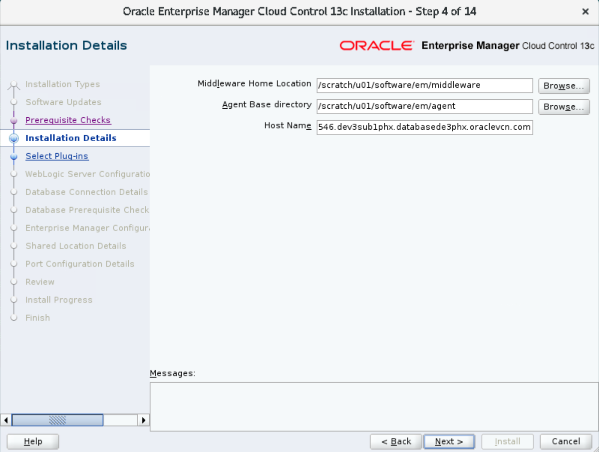
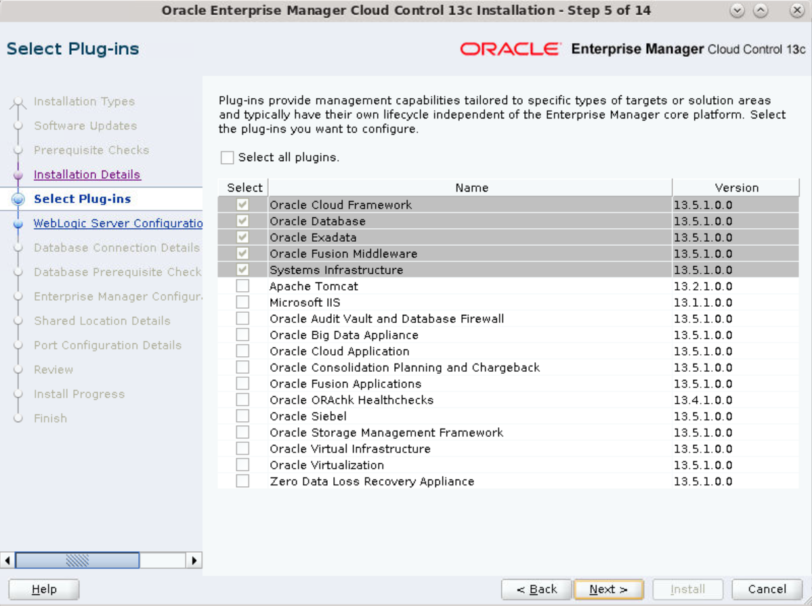
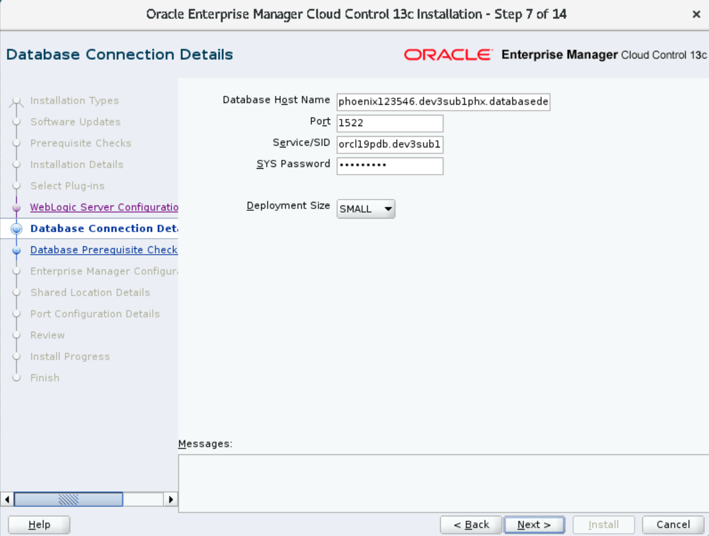
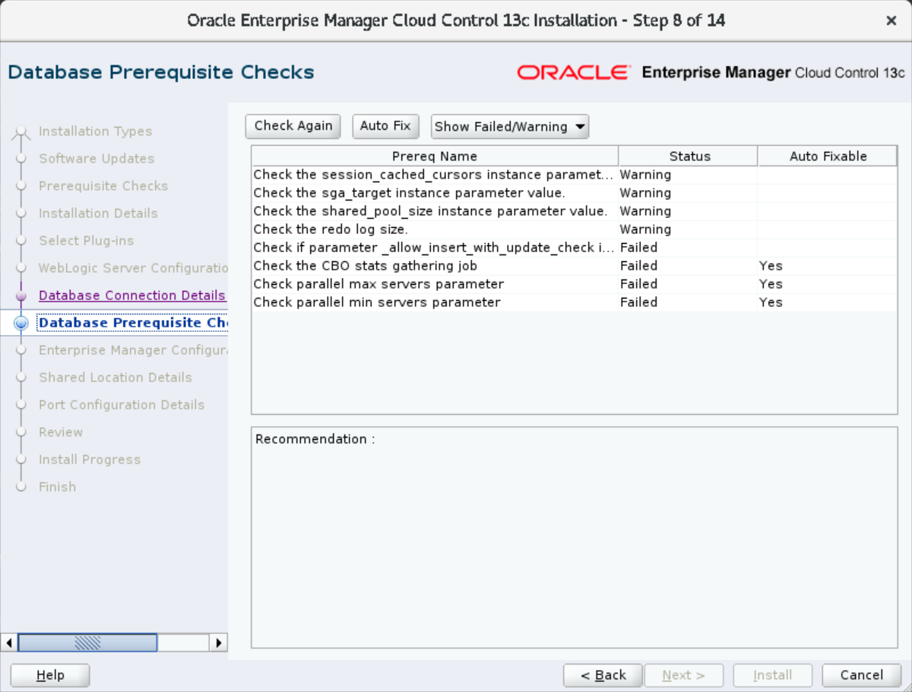
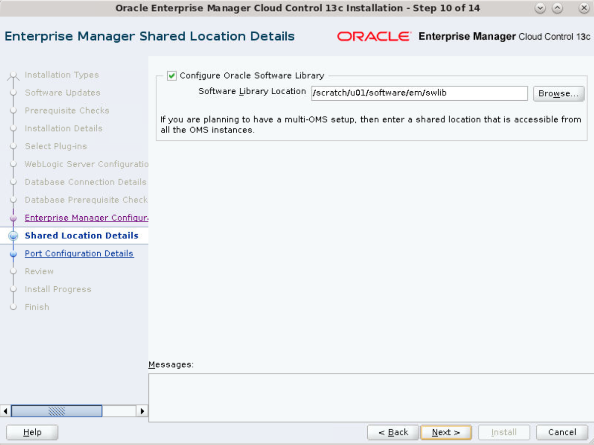
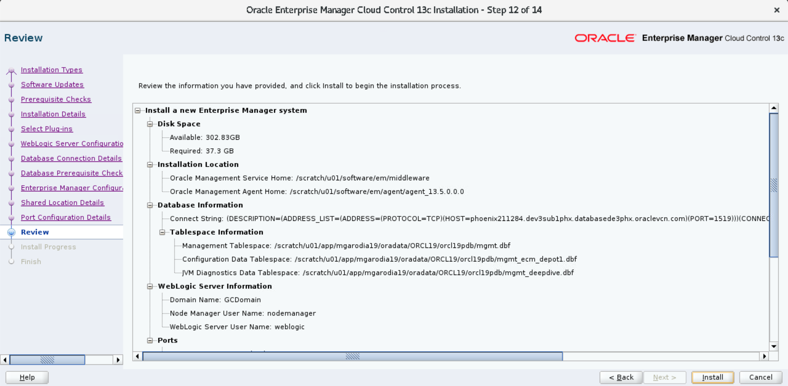

# Install Oracle EM

## Introduction
This lab covers the steps on how to install Oracle EM on VM. It also discusses the pre-installation setup, troubleshooting tips, and the steps to deinstall EM. 

## Task 1: Pre-installation setup
1. Download the EM package and validate.
1. Make the bin file executable.
1. Set the `DISPLAY` environment variable.
1. Run the EM Prereq Kit.

> **Note:** This lab walks you through the steps to install *Oracle EM 13.5*.

----
**1. Download the EM package and validate**
1. Download the complete EM package from the Oracle website [Downloads](https://www.oracle.com/enterprise-manager/downloads/cloud-control-downloads.html) or copy from other sources. 

1. Validate the bin file and all zip files. 

	## checksum files

	| Command                       | Bytes        | cksum        |
	|-------------------------------|--------------|--------------|
	| `cksum em13500_linux64.bin`   | `1586801533` | `4216113677` |
	| `cksum em13500_linux64-2.zip` | `1897494675` | `2491244121` |
	| `cksum em13500_linux64-3.zip` | `2130750885` | `3046940784` |
	| `cksum em13500_linux64-4.zip` | `1454982045` | `2971825495` |
	| `cksum em13500_linux64-5.zip` | `1494500710` | `2749926845` |

	Refer [Oracle Enterprise Manager Downloads for Linux x86-64](https://www.oracle.com/enterprise-manager/downloads/linux-x86-64-13c-rel5-downloads.html).

----
**2. Make the bin file executable**

```
$ <copy>chmod +x em13500_linux64.bin</copy>
```

Verify whether the bin file is executable.    
`ls -l` returns *rwxr-xr-x* 

```
$ <copy>ls -l</copy>
```
```
total 8363808
-rw-r--r-- 1 [user][group] 1897494675 Jun 11  2021 em13500_linux64-2.zip
-rw-r--r-- 1 [user][group] 2130750885 Jun 11  2021 em13500_linux64-3.zip
-rw-r--r-- 1 [user][group] 1454982045 Jun 11  2021 em13500_linux64-4.zip
-rw-r--r-- 1 [user][group] 1494500710 Jun 11  2021 em13500_linux64-5.zip
-rwxr-xr-x 1 [user][group] 1586801533 Jun 11  2021 em13500_linux64.bin

```

----
**3. Set the `DISPLAY` environment variable** - (Only for graphical mode)

If you do not set the `DISPLAY` environment variable, EM installer returns the following error.

```
...
Checking monitor: must be configured to display at least 256 colors.  Actual unknown.   Failed <<<<
...
```

To fix this, set the `DISPLAY` environment variable from the shell you are using, `bash` or `csh`.

 - **Shell - *bash***

	Syntax

	```
	$ export DISPLAY=<hostname>:<vnc port>.0
	```

	Example

	```
	$ <copy>export DISPLAY=phoenix123546.dev3sub1phx.databasede3phx.oraclevcn.com:1.0</copy>
	```

 - **Shell - *csh***

	Syntax

	```
	$ setenv DISPLAY <hostname>:1.0
	```

	Example

	```
	$ <copy>setenv DISPLAY phoenix123546.dev3sub1phx.databasede3phx.oraclevcn.com:1.0</copy>
	```

----
**4. Run the EM Prereq Kit**

Check and fix the prerequisites with the [EM Prerequisite Kit](https://docs.oracle.com/en/enterprise-manager/cloud-control/enterprise-manager-cloud-control/13.4/embsc/overview-em-prerequisite-kit.html#GUID-BCABED13-BFCC-4EB3-855E-28F45351323A).

```
$ <copy>./em13500_linux64.bin EMPREREQ_KIT=true</copy>
```

### Location of EM installer

| VM                                   | Path                | Remarks                                 |
|--------------------------------------|---------------------|-----------------------------------------|
| `phoenix123546.dev3sub1phx.databasede3phx.oraclevcn.com:1` | `/scratch/mgarodia/installers/emcc135`  | Executable |
| `phoenix62464.dev1sub1phx.databasede1phx.oraclevcn.com:1`  | `/scratch/u01/installers/emcc135`       | Executable |
| `slc10wsw.us.oracle.com:2`                                 | `/scratch/em_software13.5`              |           |

## Task 2: Install Oracle EM 13.5

- Launch the installer

	```
	$ <copy>./em13500_linux64.bin</copy>
	```

	## Sample output

	```
	Launcher log file is /tmp/OraInstall2022-05-20_01-45-57PM/launcher2022-05-20_01-45-57PM.log.
	Extracting the installer . . . . . . . . . . . . . . . . . . . . . . . . . . . . . . . . . . . . . . . . . . . . . . . . . . . . . . . . . . . . . . . . . . . . . . . . . . . . . . . . . . . . . . . . . . . . . . . . . . . . . . . . . . . . . . . . . . . . . . . . . . Done
	Checking monitor: must be configured to display at least 256 colors.   Actual 16777216    Passed
	Checking swap space: must be greater than 512 MB.   Actual 18191 MB    Passed
	Checking if this platform requires a 64-bit JVM.   Actual 64    Passed (64-bit not required)
	Preparing to launch the Oracle Universal Installer from /tmp/OraInstall2022-05-20_01-45-57PM
	ScratchPathValue :/tmp/OraInstall2022-05-20_01-45-57PM
	May 20, 2022 1:48:40 PM org.apache.sshd.common.io.DefaultIoServiceFactoryFactory getIoServiceProvider
	INFO: No detected/configured IoServiceFactoryFactory using Nio2ServiceFactoryFactory
	```

1. Installation Type - **Create a new Enterprise Manager system** > *Advanced Install*.

	**Figure:** EM Advance Install

1. Software Updates - *Skip*

	**Figure:** Skip Software Updates

1. Prerequisites checks. Sometimes, it displays a script to run. 

	**Figure:** Prerequisites Checks - Verify Environment

	Fix the failed items manually or click **Ignore** to skip the warnings.

	**Figure:** Ignore Issues in Environment

	If the environment meets all requirements, the status displays *Succeeded*.

	**Figure:** Prerequisites checks - Success

	Click **Next** to conitue.

1. Installation details.

	**Figure:** EM Home and Base Locations

	- **Middleware Home Location** 

		```
		<copy>/scratch/u01/software/em/middleware</copy>
		```

	- **Agent Base directory** 

		```
		<copy>/scratch/u01/software/em/agent</copy>
		```

	- **Host Name** (auto-filled)

		```
		<copy>phoenix123546.dev3sub1phx.databasede3phx.oraclevcn.com</copy>
		```

1. Select Plug-ins - Leave the defaults.

	**Figure:** Select Plug-ins to Configure

1. WebLogic Server Configuration Details.  
These credentials are required for the maintenance of EM.

	**Figure:** WebLogic Server Configuration

	- **WebLogic User Name** - *weblogic*   
	This is filled in automatically (editable, but do not modify).
	- **WebLogic Password** - Enter the password <if type="hidden">*Welcome_1*</if>   
	(re-enter to confirm password)
	- **Node Manager User Name** - `nodemanager`   
	This is filled in automatically (non-editable). 
	- **Node Manager Password** - Enter the password <if type="hidden">*Welcome_1*</if>  
	(re-enter to confirm password)

	**OMS Instance Base Location** - Leave the default, for example `/scratch/u01/software/em/gc_inst`.

	> **Note:** The password must contain at least 8 characters, begin with a letter, and include at least one numeric value.

1. Database Connection Details.   
	This page determines which database to connect to as the repository. In this example, EM connects to 19c.

	**Figure:** Database Connection Details

	- **Database Host Name**

		```
		<copy>phoenix123546.dev3sub1phx.databasede3phx.oraclevcn.com</copy>
		```

	- **Port** - *1522*   
	Check listener status in the ORACLE_HOME/bin)
	- **Service/SID** - *orcl19pdb.host-domain*   
	Enter the PDB name followed by the full domain name of the host.

		```
		<copy>orcl19pdb.dev3sub1phx.databasede3phx.oraclevcn.com</copy>
		```
	- **SYS Password** - Enter the password for Oracle Database 19c <if type="hidden">*Welcome_1*</if>   
	 
	- **Deployment Size** - *Small*/Large (select any)

	> **Note:** The password must contain at least 8 characters, begin with a letter, and include at least one numeric value. 

1. Database Prerequisite Checks.   
	For failed items, pause the installation, go to the database, and modify the parameters to fix these errors.   

	**Figure:** Check Database Parameters

	For `allow insert with update`, connect to 19c as sysdba and run this in the CDB.

	```
	SQL> <copy>alter system set "_allow_insert_with_update_check"=true scope=both;</copy>
	```

	Auto-fix if applicable. For more help, see [Troubleshooting](?lab=install-emcc#Task4:Troubleshooting). 

	Click **OK** to use the AL32UTF8 character set. 

	**Figure:** Character Set

1. Enterprise Manager Config Details. Set the login credentials for EM.

	**Figure:** EM Login Password

	- **SYSMAN Password** - Enter EM login password <if type="hidden">*Welcome_1*</if>   
	(re-enter to confirm password)
	- **Agent Registration Password** - Enter Agent login password <if type="hidden">*Welcome_1*</if>   
	(re-enter to confirm password)

	For tablespaces, leave the defaults.

	| Tablespace           | File full path                                                       |
	|----------------------|----------------------------------------------------------------------|
	| Management           | `/scratch/u01/app/mgarodia/oradata/ORCL/orclpdb/mgmt.dbf`            |
	| Configuration Data   | `/scratch/u01/app/mgarodia/oradata/ORCL/orclpdb/mgmt_ecm_depot1.dbf` |
	| JVM Diagnostics Data | `/scratch/u01/app/mgarodia/oradata/ORCL/orclpdb/mgmt_deepdive.dbf`   |

1. Configure Oracle Software Library Location. Leave the default `/scratch/u01/software/em/swlib`.

	**Figure:** Software Library Location

1. Port Configuration Details - Leave the defaults.

	**Figure:** Port Configuration Details

	Review the summary of installation and click **Next**.

1. On the Review page, review the details.

	**Figure:** Review - top

	**Figure:** Review - bottom

1. Click **Install** to start EM installation. The installation progress starts. 

	**Figure:** EM Installation progress

	 - Run the scripts automatically (or manually as `root` from the terminal).

		**Figure:** All Root script

		```
		$ <copy>/scratch/u01/software/em/middleware/allroot.sh</copy>
		```

		## Result

		```
		Starting to execute allroot.sh ......... 

		Starting to execute /scratch/u01/software/em/middleware/root.sh ......
		Check /scratch/u01/software/em/middleware/install/root_phoenix62464_2021-08-11_05-28-03.log for the output of root script

		Finished product-specific root actions.
		/etc exist
		Finished execution of  /scratch/u01/software/em/middleware/root.sh ......


		Starting to execute /scratch/u01/software/em/agent/agent_13.5.0.0.0/root.sh ......

		Finished product-specific root actions.
		/etc exist
		Finished execution of  /scratch/u01/software/em/agent/agent_13.5.0.0.0/root.sh ......
		```

	 - Return to the installer and click **OK** to continue the installation. 

1. On successful completion, the installer displays the Finish window. 

	**Figure:** EM Installation Complete - top

	**Figure:** EM Installation Complete - bottom

	> **Note:** Before you **Close** the installer, do not forget to note the EM URLs for 19c. 

| Interface                    | Link                                         |
|------------------------------|----------------------------------------------|
| EM console new             | [https://phoenix123546.dev3sub1phx.databasede3phx.oraclevcn.com:7803/em](https://phoenix123546.dev3sub1phx.databasede3phx.oraclevcn.com:7803/em)      |
| Admin server <br>console new | [https://phoenix123546.dev3sub1phx.databasede3phx.oraclevcn.com:7102/console](https://phoenix123546.dev3sub1phx.databasede3phx.oraclevcn.com:7102/console) |
| EM console old             | [https://phoenix62464.dev1sub1phx.databasede1phx.oraclevcn.com:7803/em](https://phoenix62464.dev1sub1phx.databasede1phx.oraclevcn.com:7803/em)       |
| Admin server <br>console old | [https://phoenix62464.dev1sub1phx.databasede1phx.oraclevcn.com:7102/console](https://phoenix62464.dev1sub1phx.databasede1phx.oraclevcn.com:7102/console)  |

### EM folder locations

- Middleware folder - `/scratch/u01/software/em/middleware/bin`
- Agent folder - `/scratch/u01/software/em/agent/agent_13.5.0.0.0/bin`

Cite: Another EM installation procedure explained here - [Manual EM Shiphome installation on OCI](https://confluence.oraclecorp.com/confluence/display/EMQ/Manual+EM+Shiphome+installation+on+OCI)

## Task 3: Deinstall EM

> **Note:** Do not deinstall the repository database (Oracle Database 19c) before deinstalling EM. Else, it will return an error `The OMS delete of EMGC_OMS1 has failed.`

- Run `deinstall` manually
- Deinstall using script

	## Run `deinstall` manually

	1. Create a temporary directory.
		```
		$ <copy>mkdir /scratch/u01/tmp01</copy>
		```

	1. Copy `<EM_HOME>/sysman/install/EMDeinstall.pl` to the temporary directory.

		**Example**
		```
		$ <copy>cp /scratch/u01/software/em/middleware/sysman/install/EMDeinstall.pl /scratch/u01/tmp01</copy>
		```

	1. Run the `deinstall` command.

		**Syntax**
		```
		$ <EM_HOME>/perl/bin/perl <temporary_location>/EMDeinstall.pl -mwHome <EM_HOME> -stageLoc <temporary_location>
		```

		**Example**
		```
		$ <copy>
		/scratch/u01/software/em/middleware/perl/bin/perl /scratch/u01/tmp_emccdeinstall02/EMDeinstall.pl -mwHome /scratch/u01/software/em/middleware -stageLoc /scratch/u01/tmp01
		</copy>
		```

	## Deinstall using script

	Run the `deinstall_em.sh` script from the `/scratch/mgarodia/ManishDoc/working-commands` location.

	```
	$ <copy>sh /scratch/mgarodia/ManishDoc/working-commands/deinstall_em.sh</copy>
	```

A log file is generated to capture the deinstallation process.

1. Enter ***y*** to confirm deinstalling OMS, Repository, and Agent. 

	```
	Refer to /scratch/u01/tmp_emccdeinstall/deinstall_2022-11-09_11-16-55.log for deinstall log
	Substring valuye is /scratch/u01/software/em/gc_inst
	This is a First OMS install. So, this deinstalls the OMS , Repository and Agent. Confirm (y/n) y
	```

1. Enter the passwords provided at the time of EM installation<if type="hidden">, *Welcome_1*</if>.

	```
	Enter the SYS Password : 
	Enter the sysman Password :
	Enter the Admin Server password : 
	```

	The system proceeds with the deinstallation.

	## View deinstall output

	```
	dbConnectStr - (DESCRIPTION=(ADDRESS_LIST=(ADDRESS=(PROTOCOL=TCP)(HOST=phoenix62464.dev1sub1phx.databasede1phx.oraclevcn.com)(PORT=1522)))(CONNECT_DATA=(SERVICE_NAME=orcl19cpdb.dev1sub1phx.databasede1phx.oraclevcn.com)))
	The command executed is /scratch/u01/software/em/agent/agent_13.5.0.0.0/perl/bin/perl /scratch/u01/software/em/agent/agent_13.5.0.0.0/sysman/install/AgentDeinstall.pl -agentHome /scratch/u01/software/em/agent/agent_13.5.0.0.0
	Nov 09, 2022 11:25:02 AM oracle.sysman.agent.installer.AgentInstaller$StreamGobbler run
	INFO: Oracle Enterprise Manager Cloud Control 13c Release 5
	Nov 09, 2022 11:25:02 AM oracle.sysman.agent.installer.AgentInstaller$StreamGobbler run
	INFO: Copyright (c) 1996, 2021 Oracle Corporation.  All rights reserved.
	Nov 09, 2022 11:25:08 AM oracle.sysman.agent.installer.AgentInstaller$StreamGobbler run
	INFO: Stopping agent ... stopped.
	Nov 09, 2022 11:25:08 AM oracle.sysman.agent.installer.AgentInstaller$StreamGobbler run
	INFO: Plugin homes:
	Nov 09, 2022 11:25:08 AM oracle.sysman.agent.installer.AgentInstaller$StreamGobbler run
	INFO: Plugin homes:
	Nov 09, 2022 11:25:08 AM oracle.sysman.agent.installer.AgentInstaller execCommand
	SEVERE: STDERR:

	STDOUT=

	Oracle Enterprise Manager Cloud Control 13c Release 5
	Copyright (c) 1996, 2021 Oracle Corporation.  All rights reserved.
	Stopping agent ... stopped.
	Nov 09, 2022 11:25:08 AM oracle.sysman.agent.installer.AgentDeinstallation main
	INFO: Creating directory /scratch/u01/software/em/agent/agent_13.5.0.0.0/install/tmp completed successfully.
	Nov 09, 2022 11:25:08 AM oracle.sysman.agent.installer.AgentDeinstallation main
	INFO: File /etc/oragchomelist exists.
	Nov 09, 2022 11:25:08 AM oracle.sysman.agent.installer.AgentDeinstallation main
	INFO: File /etc/oragchomelist is writable.
	Nov 09, 2022 11:25:08 AM oracle.sysman.agent.installer.AgentDeinstallation main
	INFO: Index :-1 for line :
	Nov 09, 2022 11:25:08 AM oracle.sysman.agent.installer.AgentDeinstallation main
	INFO: Index :-1 for line :
	Nov 09, 2022 11:25:08 AM oracle.sysman.agent.installer.AgentDeinstallation main
	INFO: Index :-1 for line :
	Nov 09, 2022 11:25:08 AM oracle.sysman.agent.installer.AgentDeinstallation main
	INFO: Index :0 for line : /scratch/u01/software/em/agent/agent_13.5.0.0.0:/scratch/u01/software/em/agent/agent_inst
	Nov 09, 2022 11:25:08 AM oracle.sysman.agent.installer.AgentDeinstallation main
	INFO: Overwriting the contents since oracle home:/scratch/u01/software/em/agent/agent_13.5.0.0.0 entry already exists.

	The command is /scratch/u01/software/em/middleware/bin/emctl stop oms

	 Stopping oms............ Wait for the completion of the execution.

	Oracle Enterprise Manager Cloud Control 13c Release 5
	Copyright (c) 1996, 2021 Oracle Corporation.  All rights reserved.
	Stopping Oracle Management Server...
	Node Manager Not Running
	Oracle Management Server is Down
	JVMD Engine is Down
	 return value is : 0

	The command is /scratch/u01/software/em/middleware/bin/omsca delete -full -OMSNAME EMGC_OMS1 -AS_USERNAME weblogic -REP_CONN_STR "(DESCRIPTION=(ADDRESS_LIST=(ADDRESS=(PROTOCOL=TCP)(HOST=phoenix62464.dev1sub1phx.databasede1phx.oraclevcn.com)(PORT=1522)))(CONNECT_DATA=(SERVICE_NAME=orcl19cpdb.dev1sub1phx.databasede1phx.oraclevcn.com)))"

	The oms delete will take sometime. Wait for the completion of the execution. Don't abort the execution.

	log4j:WARN No appenders could be found for logger (emctl.secure.oms.SecureOMSCmds).
	log4j:WARN Please initialize the log4j system properly.
	log4j:WARN See http://logging.apache.org/log4j/1.2/faq.html#noconfig for more info.
	Oracle Enterprise Manager Cloud Control 13c Release 13.5.0.0.0
	Copyright (c) 1996, 2021, Oracle. All rights reserved.

	Do You really want to delete the OMS (Y|N):Failed to drop OPSS schema
	OMS Deleted successfully

	 return value is : 0
	Running the command /scratch/u01/software/em/middleware/sysman/admin/emdrep/bin/RepManager -action drop -dbUser sys -dbRole sysdba -connectString "(DESCRIPTION=(ADDRESS_LIST=(ADDRESS=(PROTOCOL=TCP)(HOST=phoenix62464.dev1sub1phx.databasede1phx.oraclevcn.com)(PORT=1521)))(CONNECT_DATA=(SERVICE_NAME=orcl19cpdb.dev1sub1phx.databasede1phx.oraclevcn.com)))" -mwHome /scratch/u01/software/em/middleware -mwOraHome /scratch/u01/software/em/middleware -oracleHome /scratch/u01/software/em/middleware

	Repository drop will take sometime. Wait for the completion of the execution. Don't abort the execution.

	stty: standard input: Inappropriate ioctl for device
	stty: standard input: Inappropriate ioctl for device
	stty: standard input: Inappropriate ioctl for device
	stty: standard input: Inappropriate ioctl for device
	java.sql.SQLException: ORA-01017: invalid username/password; logon denied
			at oracle.jdbc.driver.T4CTTIoer11.processError(T4CTTIoer11.java:509)
			at oracle.jdbc.driver.T4CTTIoer11.processError(T4CTTIoer11.java:456)
			at oracle.jdbc.driver.T4CTTIoer11.processError(T4CTTIoer11.java:451)
			at oracle.jdbc.driver.T4CTTIfun.processError(T4CTTIfun.java:1040)
			at oracle.jdbc.driver.T4CTTIoauthenticate.processError(T4CTTIoauthenticate.java:552)
			at oracle.jdbc.driver.T4CTTIfun.receive(T4CTTIfun.java:550)
			at oracle.jdbc.driver.T4CTTIfun.doRPC(T4CTTIfun.java:268)
			at oracle.jdbc.driver.T4CTTIoauthenticate.doOAUTH(T4CTTIoauthenticate.java:501)
			at oracle.jdbc.driver.T4CTTIoauthenticate.doOAUTH(T4CTTIoauthenticate.java:1292)
			at oracle.jdbc.driver.T4CTTIoauthenticate.doOAUTH(T4CTTIoauthenticate.java:1025)
			at oracle.jdbc.driver.T4CConnection.logon(T4CConnection.java:743)
			at oracle.jdbc.driver.PhysicalConnection.connect(PhysicalConnection.java:793)
			at oracle.jdbc.driver.T4CDriverExtension.getConnection(T4CDriverExtension.java:57)
			at oracle.jdbc.driver.OracleDriver.connect(OracleDriver.java:747)
			at oracle.jdbc.driver.OracleDriver.connect(OracleDriver.java:562)
			at java.sql.DriverManager.getConnection(DriverManager.java:664)
			at java.sql.DriverManager.getConnection(DriverManager.java:208)
			at oracle.sysman.emdrep.schemamanager.EMConnectionHelper.createConnection(EMConnectionHelper.java:234)
			at oracle.sysman.emdrep.schemamanager.EMConnectionHelper.createConnection(EMConnectionHelper.java:151)
			at oracle.sysman.emdrep.schemamanager.EMSchemaManager.getConnection(EMSchemaManager.java:1246)
			at oracle.sysman.emdrep.schemamanager.EMSchemaManager.getConnection(EMSchemaManager.java:1210)
			at oracle.sysman.emdrep.schemamanager.EMSchemaManager.getConnection(EMSchemaManager.java:909)
			at oracle.sysman.emdrep.schemamanager.EMSchemaManager.<init>(EMSchemaManager.java:276)
			at oracle.sysman.emdrep.schemamanager.EMSchemaManager.getEMSchemaManager(EMSchemaManager.java:1028)
			at oracle.sysman.emdrep.schemamanager.EMSchemaManager.getEMSchemaManager(EMSchemaManager.java:997)
			at oracle.sysman.emdrep.schemamanager.EMSchemaManager.main(EMSchemaManager.java:1647)
	java.sql.SQLException: ORA-01017: invalid username/password; logon denied
			at oracle.jdbc.driver.T4CTTIoer11.processError(T4CTTIoer11.java:509)
			at oracle.jdbc.driver.T4CTTIoer11.processError(T4CTTIoer11.java:456)
			at oracle.jdbc.driver.T4CTTIoer11.processError(T4CTTIoer11.java:451)
			at oracle.jdbc.driver.T4CTTIfun.processError(T4CTTIfun.java:1040)
			at oracle.jdbc.driver.T4CTTIoauthenticate.processError(T4CTTIoauthenticate.java:552)
			at oracle.jdbc.driver.T4CTTIfun.receive(T4CTTIfun.java:550)
			at oracle.jdbc.driver.T4CTTIfun.doRPC(T4CTTIfun.java:268)
			at oracle.jdbc.driver.T4CTTIoauthenticate.doOAUTH(T4CTTIoauthenticate.java:501)
			at oracle.jdbc.driver.T4CTTIoauthenticate.doOAUTH(T4CTTIoauthenticate.java:1292)
			at oracle.jdbc.driver.T4CTTIoauthenticate.doOAUTH(T4CTTIoauthenticate.java:1025)
			at oracle.jdbc.driver.T4CConnection.logon(T4CConnection.java:743)
			at oracle.jdbc.driver.PhysicalConnection.connect(PhysicalConnection.java:793)
			at oracle.jdbc.driver.T4CDriverExtension.getConnection(T4CDriverExtension.java:57)
			at oracle.jdbc.driver.OracleDriver.connect(OracleDriver.java:747)
			at oracle.jdbc.driver.OracleDriver.connect(OracleDriver.java:562)
			at java.sql.DriverManager.getConnection(DriverManager.java:664)
			at java.sql.DriverManager.getConnection(DriverManager.java:208)
			at oracle.sysman.emdrep.schemamanager.EMConnectionHelper.createConnection(EMConnectionHelper.java:234)
			at oracle.sysman.emdrep.schemamanager.EMConnectionHelper.createConnection(EMConnectionHelper.java:166)
			at oracle.sysman.emdrep.schemamanager.EMSchemaManager.getConnection(EMSchemaManager.java:1246)
			at oracle.sysman.emdrep.schemamanager.EMSchemaManager.getConnection(EMSchemaManager.java:1210)
			at oracle.sysman.emdrep.schemamanager.EMSchemaManager.getConnection(EMSchemaManager.java:909)
			at oracle.sysman.emdrep.schemamanager.EMSchemaManager.<init>(EMSchemaManager.java:276)
			at oracle.sysman.emdrep.schemamanager.EMSchemaManager.getEMSchemaManager(EMSchemaManager.java:1028)
			at oracle.sysman.emdrep.schemamanager.EMSchemaManager.getEMSchemaManager(EMSchemaManager.java:997)
			at oracle.sysman.emdrep.schemamanager.EMSchemaManager.main(EMSchemaManager.java:1647)
	processing arguments 
	compiling arguments for validation
	 Enter sys user password   : 
	Verify : 
	Performing PreDropAll action...
	Enter password for: sys
	connection properties were 
	{user=sys, password=Welcome_1, internal_logon=SYSDBA}
	connection properties were 
	{user=sys, password=Welcome_1, internal_logon=SYSDBA}
	Error found: SQL exception - error has occured during the execution. The error trace message is 
	 java.sql.SQLException: ORA-01017: invalid username/password; logon denied

	The Connect Descriptor was (DESCRIPTION=(ADDRESS_LIST=(ADDRESS=(PROTOCOL=TCP)(HOST=phoenix62464.dev1sub1phx.databasede1phx.oraclevcn.com)(PORT=1521)))(CONNECT_DATA=(SERVICE_NAME=orcl19cpdb.dev1sub1phx.databasede1phx.oraclevcn.com)))
	.
	PreDropAll action failed. return value is : 0
	The command executed is /scratch/u01/software/em/middleware/oui/bin/detachHome.sh
	Launcher log file is /tmp/OraInstall2022-11-10_01-27-43PM/launcher2022-11-10_01-27-43PM.log.
	Checking swap space: must be greater than 500 MB.   Actual 18191 MB    Passed
	Checking if this platform requires a 64-bit JVM.   Actual 64    Passed (64-bit not required)
	detachHome was successful.
	Logs successfully copied to /scratch/u01/app/oraInventory/logs.
	 return value is : 0

	Deleting the instance home 
	Deleting the em home
	The deinstallation of OMS is successful. 

	The location of the file is : /etc/oragchomelist
	```

## Task 4: Troubleshooting

 - For installation related issues, check the log file under `/tmp/OraInstalldate_time/Installdate_time.log`

	----
	## EM Install: Database prerequisites check

	 - `allow insert with update`

		Log in to the SQL command line of the repository database (for example, 19c) as *sysdba* and run this.

		```
		$ ./sqlplus / as sysdba

		SQL> <copy>alter system set "_allow_insert_with_update_check"=true scope=both;</copy>
		```

	 - `Database Optimizer Adaptive Features Requirements`

		```
		SQL> <copy>alter system set optimizer_adaptive_features=false scope=both;</copy>
		```

	 - Connect to Oracle Database as SYSDBA and run these:

		```	
		$ ./sqlplus / as sysdba

		SQL>
		<copy>
		alter system reset "_optimizer_nlj_hj_adaptive_join" scope=both sid='*';
		alter system reset "_optimizer_strans_adaptive_pruning" scope=both sid='*';
		alter system reset "_px_adaptive_dist_method" scope=both sid='*';
		alter system reset "_sql_plan_directive_mgmt_control" scope=both sid='*';
		alter system reset "_optimizer_dsdir_usage_control" scope=both sid='*';
		alter system reset "_optimizer_use_feedback" scope=both sid='*';
		alter system reset "_optimizer_gather_feedback" scope=both sid='*';
		alter system reset "_optimizer_performance_feedback" scope=both sid='*';
		</copy>
		```

	 - Disable `password verify function`

		> **Note:** To find out what users are using `PASSWORD_VERIFY_FUNCTION`, you need to know which profiles are using the function and then see which users are assigned to that profile.

		```
		SQL> <copy>alter profile default limit password_verify_function null;</copy>
		```

		Ensure that you have all the PDBs open. 
		
		```
		SQL> <copy>alter pluggable database all open;</copy>
		```

	----
	## EM Install: Installer wizard does not launch?

	**Problem statement**   
	You try installing EM from the terminal with `./em13500_linux64.bin`. The installation initiates but does not launch the installer window/wizard. The installer either exits with an error or does not display the wizard at all. 

	```
	...
	Exception in thread "main" java.awt.AWTError: Can't connect to X11 window server using '<hostname>:1.0' as the value of the DISPL
		at sun.awt.X11GraphicsEnvironment.initDisplay(Native Method)
	...
	...
	The log(s) can be found here: /tmp/OraInstall-date_time.
	ERROR: Installer execution failed (1).
	```

	**Cause**   
	The host authentication was disabled.

	**Solution**   
	Add the client authentication with the `xhost` program. It adds the host name to the list allowed to connect to the X server.

	```
	$ <copy>xhost</copy>

	access control enabled, only authorized clients can connect
	SI:localuser:mgarodia
	```

	Run the EM installer again.

	----
	## EM Install: Insufficient free space in *`/tmp`*

	**Problem statement**   
	You try installing EM from the terminal with `./em13500_linux64.bin`. The installation does not start and returns an error for insufficient free space. 

	```
	ERROR: Temporary directory /tmp does not have enough free space. At least 12289 MB of free space are required.
	Please input another directory or [Exit]: Enter
	ERROR: Cannot setup the extract directory /tmp/sfx_HYdGXn (-1).
	```

	> **Note:** The installer requires *~14 GB* of hard disk space in the temporary directory. 
	
	**Solution**   
	If the default temporary directory does not have the required amount of space, then provide an alternative location for the temporary directory.

	```
	$ <copy>./em13500_linux64.bin -J-Djava.io.tmpdir=/scratch/u01/tmp1</copy>
	```

	Run the EM installer again.

	----
	## EM Install: Unset classpath

	Unset the `CLASSPATH` environment variable.

	 - bash

		```
		$ <copy>export CLASSPATH=""</copy>
		```

	 - csh

		```
		$ <copy>unset CLASSPATH</copy>
		```

	----
	## EM Install: Invalid repository

	The referenced database doesn't contain a valid management Repository

	**Problem statement**   
	You are installing a new copy of Enterprise Manager (EM) and it returns this error. 

	

	**Cause**   
	You deleted the earlier copy of EM from your system manually but the repository database (Oracle Database 19c) still contains residue objects from the old installation. 

	**Solution**   
	Clean the database of old objects before using it again as an OMS repository database.

	 1. Drop sysman related schemas.

		```
		SQL> 
		<copy>
		DROP USER SYSMAN CASCADE; 
		DROP USER SYSMAN_OPSS CASCADE;
		DROP USER SYSMAN_MDS CASCADE;
		DROP USER SYSMAN_APM CASCADE;
		DROP USER SYSMAN_RO CASCADE;
		DROP USER SYSMAN_BIPLATFORM CASCADE;
		DROP USER SYSMAN_STB CASCADE;
		</copy>
		```

	 1. Remove Synonyms related to sysman accounts.

		```
		SQL> 
		<copy>
		DECLARE
		  CURSOR l_syn_csr IS
			SELECT 'DROP ' ||
			  CASE owner
				WHEN 'PUBLIC'
				  THEN 'PUBLIC SYNONYM '
				ELSE 'SYNONYM ' || owner || '.'
			  END ||
			  synonym_name AS cmd
			FROM
			  dba_synonyms
			WHERE
			  table_owner IN (
				'SYSMAN',
				'SYSMAN_MDS',
				'MGMT_VIEW',
				'SYSMAN_BIP',
				'SYSMAN_APM',
				'BIP',
				'SYSMAN_OPSS',
				'SYSMAN_RO'
			  );
		BEGIN
		  FOR l_syn_rec IN l_syn_csr LOOP
			BEGIN
			  EXECUTE IMMEDIATE l_syn_rec.cmd;
			EXCEPTION
			  WHEN OTHERS THEN
				dbms_output.put_line( '===> ' || l_syn_rec.cmd );
				dbms_output.put_line( sqlerrm );
			END;
		  END LOOP;
		END;
		/
		</copy>
		```

	 1. Remove remaining Objects and tablespaces.

		```
		SQL> 
		<copy>
		DROP USER mgmt_view CASCADE;
		DROP TABLESPACE mgmt_ecm_depot_ts INCLUDING CONTENTS AND DATAFILES CASCADE CONSTRAINTS;
		DROP TABLESPACE mgmt_tablespace   INCLUDING CONTENTS AND DATAFILES CASCADE CONSTRAINTS;
		DROP TABLESPACE mgmt_ad4j_ts      INCLUDING CONTENTS AND DATAFILES CASCADE CONSTRAINTS;
		</copy>
		```

	1.  As proper database cleaning using RepManager dropall didn't happen, so clean up the registry details.

		```
		SQL> 
		<copy>
		DELETE
		  FROM
			schema_version_registry
		  WHERE
			(comp_name,owner) IN (
			  ('Authorization Policy Manager','SYSMAN_APM'),
			  ('Metadata Services','SYSMAN_MDS'),
			  ('Oracle Platform Security Services','SYSMAN_OPSS')
			);
		commit;
		</copy>
		```

		```
		SQL> <copy>ALTER SYSTEM SET optimizer_dynamic_sampling = 0 SCOPE=both;</copy>
		```

	Now try the installation again. It should complete successfully.

	Alternatively, (a longer but working solution is) deinstall both EM and the repository database (Oracle Database 19c) and reinstall them again. 

	**Cite**: 
	 - [funoracleapps](https://www.funoracleapps.com/2019/05/oem-13c-installation-failed-with.html)
	 - [sujeetdba](https://sujeetdba.blogspot.com/2016/09/the-referenced-database-doesnt-contain.html)

	Unsuccessful. Issue did not resolve with this solution. 

	----
	## EM unreachable

		```
		Checking the connection   
		Checking the proxy and the firewall   
		ERR_CONNECTION_REFUSED
		```

	### OMS/Agent Errors

	**Problem: OMS and/or Agent down**

	- Check OMS status.

		```
		$ <copy>./emctl status oms</copy>

		WebTier is Down
		Oracle Management Server is Down
		JVMD Engine is Down
		```

	- Check Agent status.

		```
		$ <copy>./emctl status agent</copy>

		Agent heartbeat status: OMS is unreachable
		```

	**Solution**:

	- Start OMS.

		```
		$ <copy>./emctl start oms</copy>
		```

	- Start agent.

		```
		$ <copy>./emctl start agent</copy>
		```

	- Force stop OMS.

		**Syntax**   
		`$ <OMS_HOME>/bin>./emctl stop oms -all -force`

		**Example**
		```
		$ <copy>/scratch/u01/software/em/middleware/bin/emctl stop oms -all -force</copy>
		```

		```
		$ <copy>ps -ef | grep EMGC_ADMINSERVER</copy>
		5005  7072
		```
		```
		$ <copy>ps -ef | grep EMGC_OMS1</copy>
		5024  7072
		```
		```
		$ <copy>ps -ef | grep java</copy>
		5039  7072
		```

		This is only for 11g and 12c environments. For 13c, checking for OPMN is not required.

		```
		$ <copy>ps -ef | grep opmn</copy>
		5052  7072
		```

		```
		$ <copy>XX:+UnlockCommercialFeatures -XX:+ResourceManagement</copy>
		```

	----
	## Start OMS failed 

	**Problem statement**   
	You issue the command to start oms `./emctl start oms` but it failed. 

	```
	$ <OMS_HOME>/bin>./emctl start oms

	Starting Oracle Management Server...
	Starting WebTier...
	WebTier Successfully Started
	Oracle Management Server Could Not Be Started
	Oracle Management Server is Down
	JVMD Engine is down
	```

	```
	$ OMS_HOME = <copy>/scratch/u01/software/em/middleware</copy>
	```

	------

	**Solution 1**

	1. Download [oms_start.zip](https://support.oracle.com/epmos/main/downloadattachmentprocessor?parent=DOCUMENT&sourceId=1495519.1&attachid=1495519.1:OMSSTARTZIP&clickstream=yes) file

	1. Copy `oms_start.zip` file to `<OMS_ORACLE_HOME>` directory and unzip contents in the same directory

		```
		$ <copy>unzip /scratch/u01/software/em/middleware/oms_start.zip</copy>
		```

	1. Execute `<OMS_HOME>/oms_start.sh` as per the `readme.txt` file present at `<OMS_HOME>`.

		This script cleans up the leftover processes and may restart OMS successfully.

	------

	**Solution 2**

	Clean-up leftover OMS processes manually 

	> **Note:** Ensure that the listener and the repository database (19c) are up before proceeding with these steps.

	1. Go to the `<OMS_HOME>/bin` directory.

		```
		$ <copy>cd /scratch/u01/software/em/middleware/bin</copy>
		```

	1. Stop OMS

		```
		$ <copy>./emctl stop oms -all -force</copy>
		```

	1. Get the process id of leftover processes

		```
		$ <copy>ps -ef | grep EMGC_ADMINSERVER</copy>
		```

		```
		$ <copy>ps -ef | grep EMGC_OMS1</copy>
		```

		```
		$ <copy>ps -ef | grep java</copy>
		```

	1. Kill the left over OMS java processes.

		Graceful 
		```
		$ <copy>kill <PID></copy>
		```

		Force
		```
		$ <copy>kill -9<PID></copy>
		```

	1. Delete the following files (if they exist).

		```
		$ <copy>cd /scratch/u01/software/em/gc_inst/user_projects/domains/GCDomain/servers/EMGC_OMS1/data/store/diagnostics</copy> 
		$ rm -f WLS_DIAGNOSTICS000000.DAT
		```
		```
		$ <copy>cd /scratch/u01/software/em/gc_inst/user_projects/domains/GCDomain/servers/EMGC_OMS1/data/store/default</copy>
		rm -f _WLS_EMGC_OMS1000000.DAT
		```
		```
		$ <copy>cd /scratch/u01/software/em/gc_inst/user_projects/domains/GCDomain/servers/EMGC_ADMINSERVER/data/store/diagnostics</copy>
		$ rm -f WLS_DIAGNOSTICS000000.DAT
		```
		```
		$ <copy>cd /scratch/u01/software/em/gc_inst/user_projects/domains/GCDomain/servers/EMGC_ADMINSERVER/data/store/default</copy>
		$ rm -f _WLS_EMGC_ADMINSERVER000000.DAT
		```
		```
		$ <copy>cd /scratch/u01/software/em/gc_inst/user_projects/domains/GCDomain/config</copy>
		$ rm -f config.lok
		```
		```
		$ <copy>cd /scratch/u01/software/em/gc_inst/user_projects/domains/GCDomain/servers/EMGC_OMS1/tmp</copy>
		$ rm -f EMGC_OMS1.lok 
		```
		```
		$ <copy>cd /scratch/u01/software/em/gc_inst/user_projects/domains/GCDomain/servers/EMGC_ADMINSERVER/tmp</copy>
		$ rm -f EMGC_ADMINSERVER.lok
		```

		If the OEM is configured with BIP, remove the following files as well.

		```
		$ <copy>cd /scratch/u01/software/em/gc_inst/user_projects/domains/GCDomain/servers/BIP/data/store/diagnostics</copy>
		$ rm -f WLS_DIAGNOSTICS000000.DAT
		```
		```
		$ <copy>/scratch/u01/software/em/gc_inst/user_projects/domains/GCDomain/servers/BIP/data/store/default</copy>
		$ rm -f _WLS_BIP000000.DAT
		```
		```
		$ <copy>/scratch/u01/software/em/gc_inst/user_projects/domains/GCDomain/servers/BIP/tmp</copy>
		$ rm -f BIP.lok
		```

	1. Delete ONLY *`.lck`*, *`.pid`*, and *`.state`* files in these locations.

		> **Note:** *DO NOT delete* any other files. *DO NOT delete* the directories themselves.

		```
		$ <copy>cd /scratch/u01/software/em/gc_inst/user_projects/domains/GCDomain/servers/EMGC_OMS1/data/nodemanager</copy>
		$ rm -f *.lck, *.pid, *.state
		```
		```
		$ <copy>cd /scratch/u01/software/em/gc_inst/user_projects/domains/GCDomain/servers/EMGC_ADMINSERVER/data/nodemanager</copy>
		$ rm -f *.lck, *.pid, *.state
		```
		```
		$ <copy>cd /scratch/u01/software/em/gc_inst/user_projects/domains/GCDomain/servers/BIP/data/nodemanager</copy>
		$ rm -f *.lck, *.pid, *.state
		```

	Verify that - 

	1. `emctl` is executed from the correct `OMS home`.
	1. `emctl` file size is not zero bytes.

		 If it is zero bytes refer [Note 1404623.1](https://support.oracle.com/epmos/faces/DocumentDisplay?parent=DOCUMENT&sourceId=1495519.1&id=1404623.1): How to Recreate the emctl Script for the Enterprise Manager OMS

	1. Repository database and listener are up
	1. SYSMAN connectivity to repository db is successful.

		```
		$ OMS_HOME/bin/sqlplus sysman@<Connect Descriptor>
		```

	1. SYSMAN related users acccount status in the repository database is *open*.

		```
		SQL><copy>select username,account_status from dba_users where username like 'SYSMAN%' order by username;</copy>

		USERNAME                           ACCOUNT_STATUS
		------------------------------ --------------------------------
		SYSMAN                                     OPEN
		SYSMAN_APM                                 OPEN
		SYSMAN_MDS                                 OPEN
		SYSMAN_OPSS                                OPEN
		```

	1. No invalid objects exist for sysman related users. 

		(Refer Use Case 2 in  [Note 1683050.1](https://support.oracle.com/epmos/faces/DocumentDisplay?parent=DOCUMENT&sourceId=1495519.1&id=1683050.1): OMS Failed to Start With Error 'Oracle Management Server is Down. Console may not be up')

	1. Repository database  table space is not full (alert log file does not have table space full errors).

	1. Enough space is available for the repository database archive logs.

	1. Restart the repository database and the listener. 

	Cite: [Oracle Support (Doc ID 1495519.1)](https://support.oracle.com/epmos/faces/DocumentDisplay?_afrLoop=542346969019436&parent=EXTERNAL_SEARCH&sourceId=PROBLEM&id=1495519.1&_afrWindowMode=0&_adf.ctrl-state=dfc7k3t0h_53)

## Acknowledgements

 - **Author** - Manish Garodia, Team Database UAD
 - **Last Updated on** - November 27, (Sun) 2022
 - **Questions/Feedback?** - Blame [manish.garodia@oracle.com](./../../../intro/files/email.md)
