# Install Oracle EMCC 13.5

## Introduction
This lab covers the steps on how to install Oracle EMCC on VM. 

## Task 1: Pre-installation setup
1. Download the EM package and validate.
1. Make the bin file executable.
1. Set the `DISPLAY` environment variable.
1. Run the EM Prereq Kit.

----
**1. Download the EM package and validate**
1. Download the complete EMCC package from the Oracle website [Downloads](https://www.oracle.com/enterprise-manager/downloads/cloud-control-downloads.html) or copy from other sources. 

1. Validate the bin file and all zip files. 

	## checksum files

	| Command                       | Bytes        | cksum        |
	|-------------------------------|--------------|--------------|
	| `cksum em13500_linux64.bin`   | `1586801533` | `4216113677` |
	| `cksum em13500_linux64-2.zip` | `1897494675` | `2491244121` |
	| `cksum em13500_linux64-3.zip` | `2130750885` | `3046940784` |
	| `cksum em13500_linux64-4.zip` | `1454982045` | `2971825495` |
	| `cksum em13500_linux64-5.zip` | `1494500710` | `2749926845` |

	Refer [Oracle Enterprise Manager Downloads for Linux x86-64](https://www.oracle.com/enterprise-manager/downloads/linux-x86-64-13c-rel5-downloads.html).

----
**2. Make the bin file executable**

```
<copy>chmod +x em13500_linux64.bin</copy>
```

Verify whether the bin file is executable.    
`ls -l` returns *rwxr-xr-x* 

----
**3. Set the `DISPLAY` environment variable** - (Only for graphical mode)

- **Shell - bash**

	Syntax
	```
	export DISPLAY=<hostname>:<vnc port>.0
	```
	Example
	```
	<copy>export DISPLAY=phoenix62464.dev1sub1phx.databasede1phx.oraclevcn.com:1.0</copy>
	```
- **Shell - csh**

	Syntax
	```
	setenv DISPLAY <hostname>:1.0
	```
	Example
	```
	<copy>setenv DISPLAY phoenix62464.dev1sub1phx.databasede1phx.oraclevcn.com:1.0</copy>
	```

----
**4. Run the EM Prereq Kit**

Check and fix the prerequisites with the [EM Prerequisite Kit](https://docs.oracle.com/en/enterprise-manager/cloud-control/enterprise-manager-cloud-control/13.4/embsc/overview-em-prerequisite-kit.html#GUID-BCABED13-BFCC-4EB3-855E-28F45351323A).

```
<copy>./em13500_linux64.bin EMPREREQ_KIT=true</copy>
```

### Location of EMCC installer

| VM                                                        | Path                                    | Remarks        |
|-----------------------------------------------------------|-----------------------------------------|----------------|
| `phoenix62464.dev1sub1phx.databasede1phx.oraclevcn.com:1` | `/home/mgarodia/Downloads/emcc135_copy` | Executable     |
| `phoenix62464.dev1sub1phx.databasede1phx.oraclevcn.com:1` | `/scratch/u01/installers/emcc135`       | Not executable |
| `slc10wsw.us.oracle.com:2`                                | `/scratch/em_software13.5`              |                |

## Task 2: Install Oracle EMCC 13.5

1. Launch the installer. 

	```
	<copy>./em13500_linux64.bin</copy>
	```
1. Installation Type - **Create a new Enterprise Manager system** > *Advanced Install*.

	**Figure:** EMCC Advance Install

1. Software Updates - *Skip*

	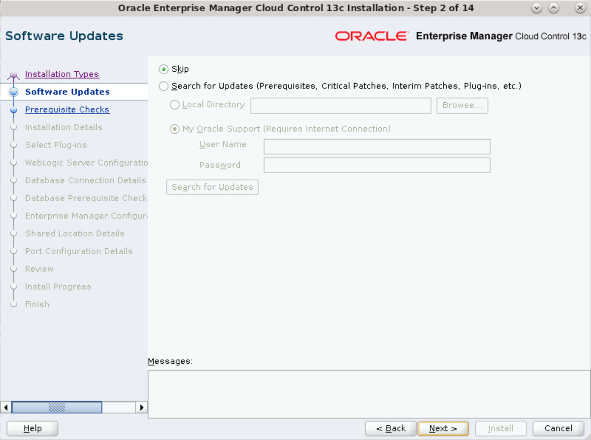**Figure:** Skip Software Updates

1. Prerequisites checks - fix manually for failed item or **Ignore** the warnings.   
   Sometimes, it displays a script to run. 

	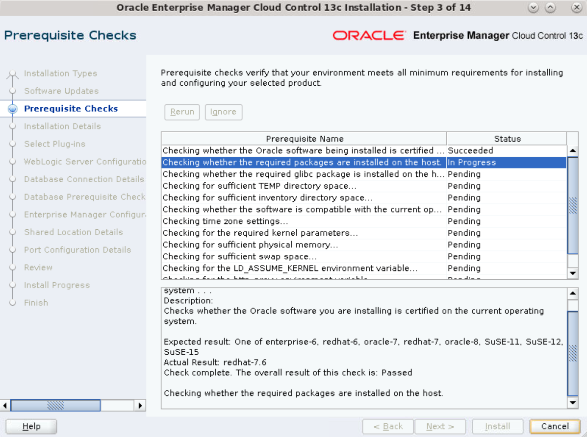**Figure:** Prerequisites Checks - Verify Environment

	**Figure:** Ignore Issues in Environment

1. Installation details.

	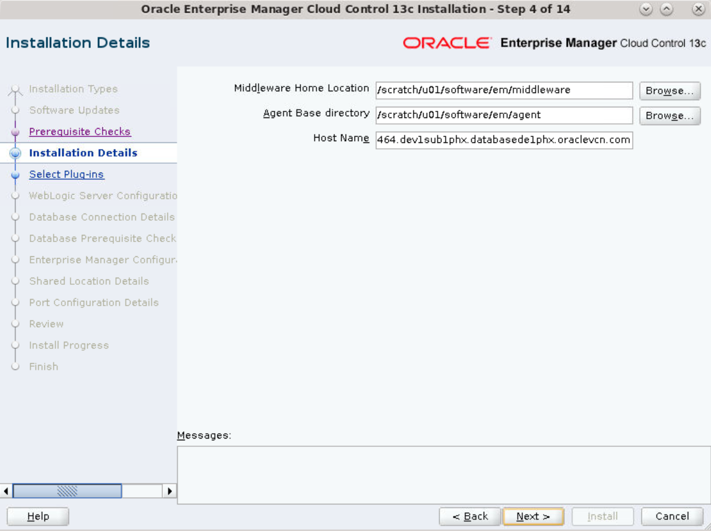**Figure:** EM Home and Base Locations

	- **Middleware Home Location** - */scratch/u01/software/em/middleware*
	- **Agent Base directory** - */scratch/u01/software/em/agent*
	- **Host Name** - *phoenix62464.dev1sub1phx.databasede1phx.oraclevcn.com*

1. Select Plug-ins - Leave the defaults.

	**Figure:** Select Plug-ins to Configure

1. WebLogic Server Configuration Details.  
These credentials are required for the maintenance of EM.

	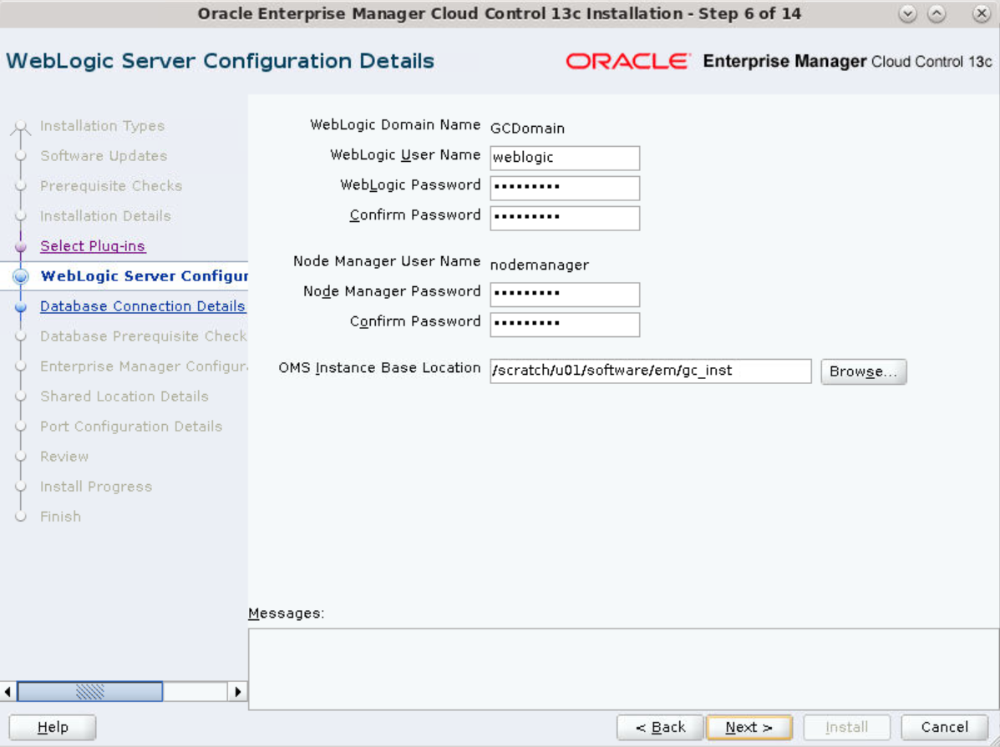**Figure:** WebLogic Server Configuration

	- **WebLogic User Name** - *weblogic*   
	This is filled in automatically (editable, but do not modify).
	- **WebLogic Password** - Enter the password <if type="hidden">*Welcome_1*</if>   
	(re-enter to confirm password)
	- **Node Manager User Name** - `nodemanager`   
	This is filled in automatically (non-editable). 
	- **Node Manager Password** - Enter the password <if type="hidden">*Welcome_1*</if>  
	(re-enter to confirm password)

	**OMS Instance Base Location** - Leave the default, for example `/scratch/u01/software/em/gc_inst`.

	> **Note:** The password must contain at least 8 characters, begin with a letter, and include at least one numeric value.

1. Database Connection Details.   
	This page determines which database to connect to as the repository. In this example, EMCC connects to 19c.

	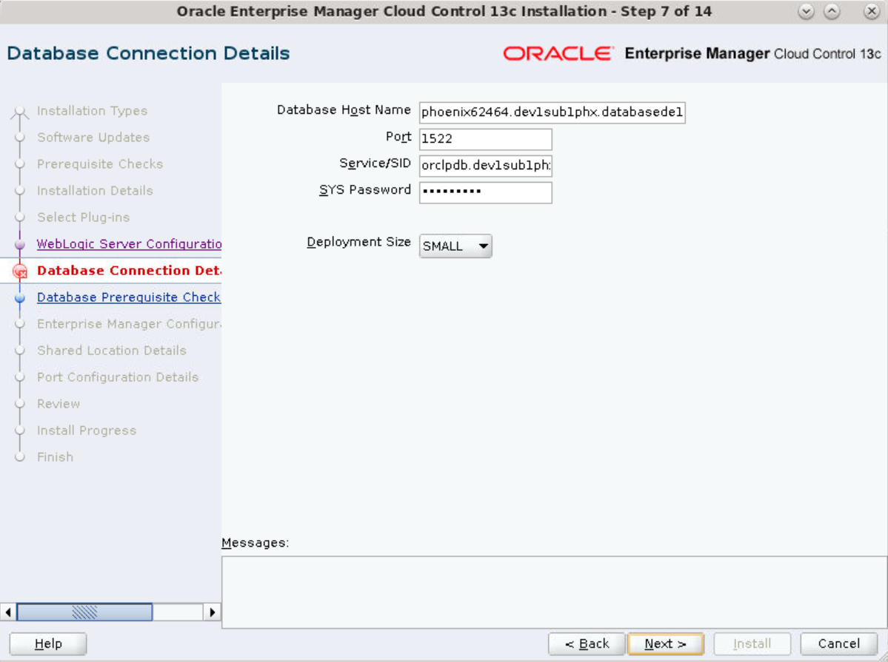**Figure:** Database Connection Details

	- **Database Host Name** - *phoenix62464.dev1sub1phx.databasede1phx.oraclevcn.com*
	- **Port** - *1522*   
	Check listener status in the ORACLE_HOME/bin)
	- **Service/SID** - *orcl19cpdb.host-domain*   
	Enter the PDB name followed by the full domain name of the host.

		```
		<copy>orcl19cpdb.dev1sub1phx.databasede1phx.oraclevcn.com</copy>
		```
	- **SYS Password** - Enter the password for Oracle Database 19c <if type="hidden">*Welcome_1*</if>   
	 
	- **Deployment Size** - *Small*/Large (select any)

	> **Note:** The password must contain at least 8 characters, begin with a letter, and include at least one numeric value. 

1. Database Prerequisite Checks.   
	For failed items, pause the installation, go to the database, and modify the parameters to fix these errors.   

	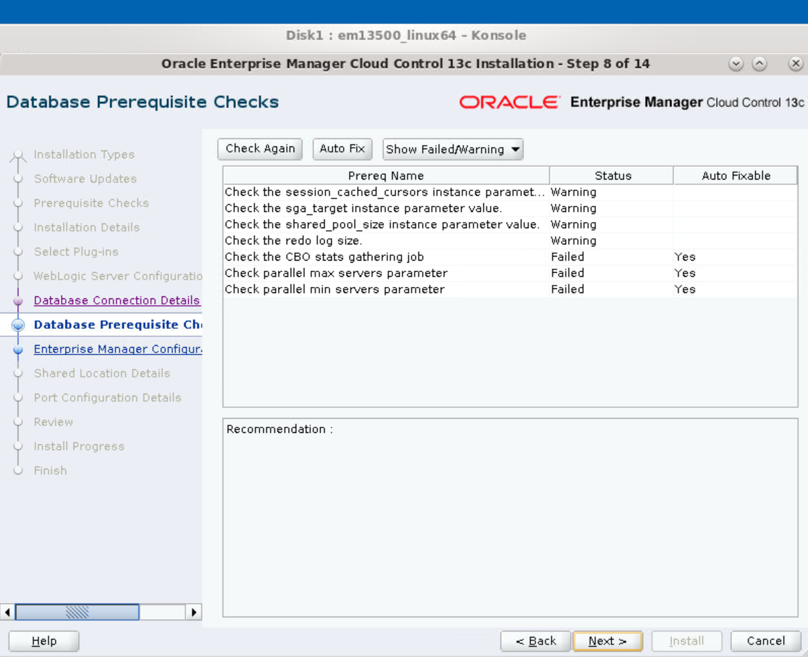**Figure:** Check Database Parameters

	See Troubleshooting. Auto-fix if applicable. 

1. Click **OK** to use the AL32UTF8 character set. 

	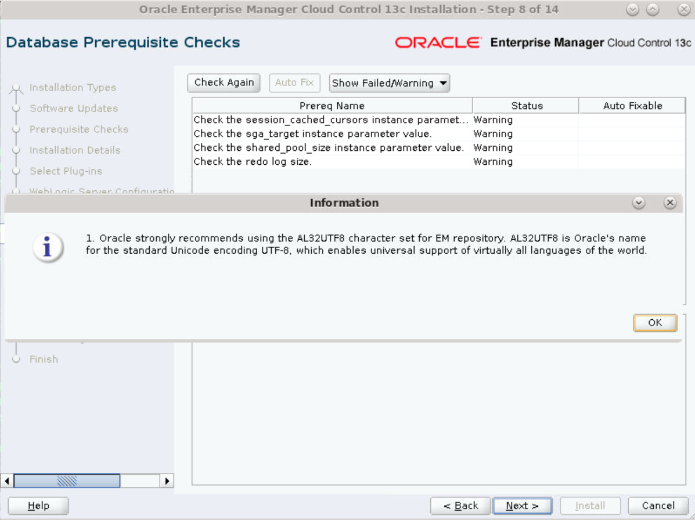**Figure:** Character Set

1. Enterprise Manager Config Details. Set the login credentials for EMCC.

	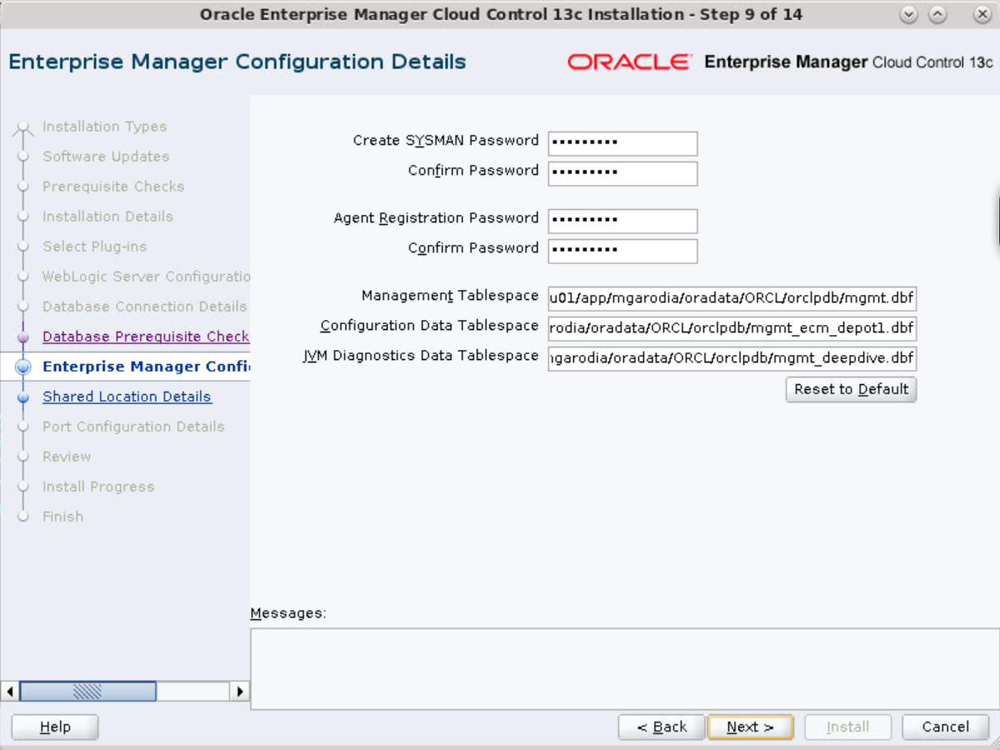**Figure:** EMCC Login Password

	- **SYSMAN Password** - Enter EM login password <if type="hidden">*Welcome_1*</if>   
	(re-enter to confirm password)
	- **Agent Registration Password** - Enter Agent login password <if type="hidden">*Welcome_1*</if>   
	(re-enter to confirm password)

	For tablespaces, leave the defaults.

	| Tablespace           | File full path                                                       |
	|----------------------|----------------------------------------------------------------------|
	| Management           | `/scratch/u01/app/mgarodia/oradata/ORCL/orclpdb/mgmt.dbf`            |
	| Configuration Data   | `/scratch/u01/app/mgarodia/oradata/ORCL/orclpdb/mgmt_ecm_depot1.dbf` |
	| JVM Diagnostics Data | `/scratch/u01/app/mgarodia/oradata/ORCL/orclpdb/mgmt_deepdive.dbf`   |

1. Configure Oracle Software Library Location. Leave the default `/scratch/u01/software/em/swlib`.

	**Figure:** Software Library Location

1. Port Configuration Details - Leave the defaults.

	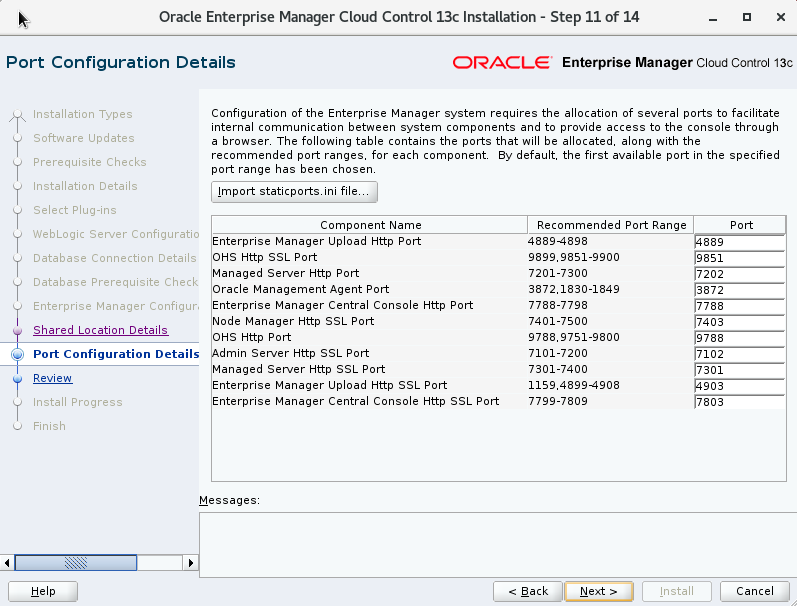**Figure:** Port Configuration Details

1. Review the summary of installation and click **Next**.

1. On the Review page, review the details and click **Install** to start EM installation.

	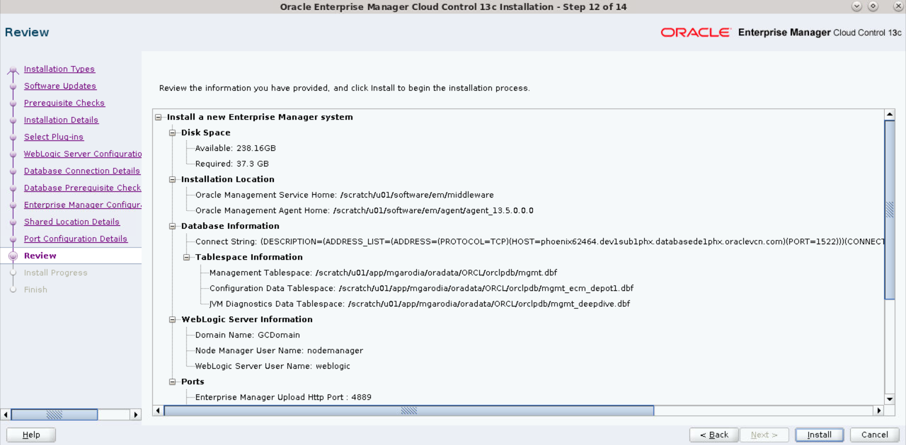**Figure:** Review - top

	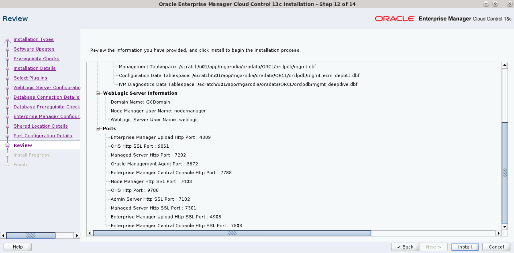**Figure:** Review - bottom

   The installation progress starts. 

	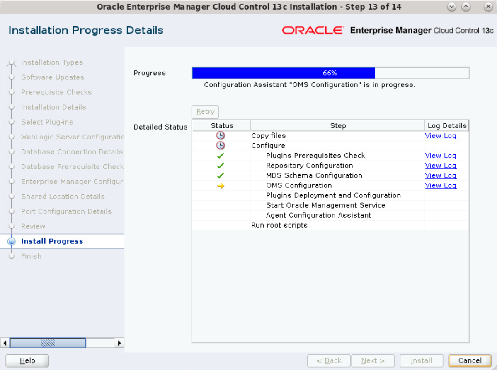**Figure:** EMCC Installation progress

1. Run the scripts automatically (or manually as `root` from the terminal).

	**Figure:** All Root script

	```
	$ <copy>/scratch/u01/software/em/middleware/allroot.sh</copy>
	```

	## Result

	```
	Starting to execute allroot.sh ......... 

	Starting to execute /scratch/u01/software/em/middleware/root.sh ......
	Check /scratch/u01/software/em/middleware/install/root_phoenix62464_2021-08-11_05-28-03.log for the output of root script

	Finished product-specific root actions.
	/etc exist
	Finished execution of  /scratch/u01/software/em/middleware/root.sh ......


	Starting to execute /scratch/u01/software/em/agent/agent_13.5.0.0.0/root.sh ......

	Finished product-specific root actions.
	/etc exist
	Finished execution of  /scratch/u01/software/em/agent/agent_13.5.0.0.0/root.sh ......
	```

1. Note the EMCC URLs for 19c and **Close** the installer. 

	**Figure:** EMCC Installation Complete - top

	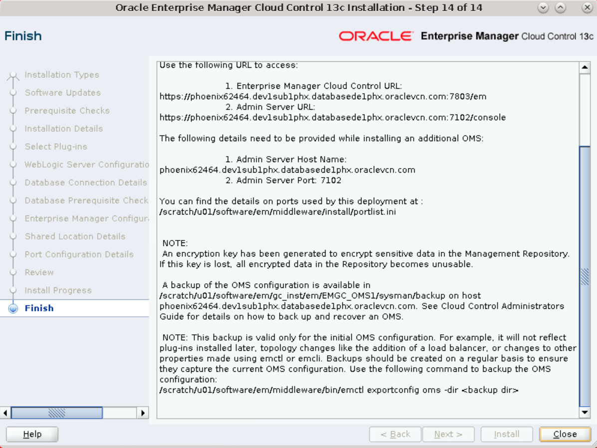**Figure:** EMCC Installation Complete - bottom

| Interface            | Link                                                |
|----------------------|-----------------------------------------------------|
| EMCC console         | [https://phoenix62464.dev1sub1phx.databasede1phx.oraclevcn.com:7803/em](https://phoenix62464.dev1sub1phx.databasede1phx.oraclevcn.com:7803/em)      |
| Admin server <br>console | [https://phoenix62464.dev1sub1phx.databasede1phx.oraclevcn.com:7102/console](https://phoenix62464.dev1sub1phx.databasede1phx.oraclevcn.com:7102/console) |

### EM folder locations

- Middleware folder - `cd /scratch/u01/software/em/middleware/bin`
- Agent folder - `cd /scratch/u01/software/em/agent/agent_13.5.0.0.0/bin`

## Task 3: Troubleshooting

Check the log file under `/tmp/OraInstalldate_time/Installdate_time.log`

- Log in to the SQL command line as sysdba and run this.

	```
	$ ./sqlplus / as sysdba

	SQL> <copy>alter system set "_allow_insert_with_update_check"=true scope=both;</copy>
	```

- Unset the `CLASSPATH` environment variable.

	Option 1
	```
	$ <copy>export CLASSPATH=""</copy>
	```
	Option 2
	```
	$ <copy>unset CLASSPATH</copy>
	```

- **Database Optimizer Adaptive Features Requirements**

	```
	SQL> <copy>alter system set optimizer_adaptive_features=false scope=both;</copy>
	```

- **Connect to Oracle Database as SYSDBA and run the following commands**

	```	
	$ ./sqlplus / as sysdba

	SQL>
	<copy>
	alter system reset "_optimizer_nlj_hj_adaptive_join" scope=both sid='*';
	alter system reset "_optimizer_strans_adaptive_pruning" scope=both sid='*';
	alter system reset "_px_adaptive_dist_method" scope=both sid='*';
	alter system reset "_sql_plan_directive_mgmt_control" scope=both sid='*';
	alter system reset "_optimizer_dsdir_usage_control" scope=both sid='*';
	alter system reset "_optimizer_use_feedback" scope=both sid='*';
	alter system reset "_optimizer_gather_feedback" scope=both sid='*';
	alter system reset "_optimizer_performance_feedback" scope=both sid='*';
	</copy>
	```

- **Disable password verify function**  
	To find out what users are using `PASSWORD_VERIFY_FUNCTION`, you need to find out which profiles are using the function and then see which users are assigned that profile.

	```
	SQL> <copy>alter profile default limit password_verify_function null;</copy>
	```

- EMCC unreachable

	```
	Checking the connection   
	Checking the proxy and the firewall   
	ERR_CONNECTION_REFUSED
	```

### OMS/Agent Errors

**Problem: OMS and/or Agent down**

- Check OMS status.

	```
	$ <copy>./emctl status oms</copy>

	WebTier is Down
	Oracle Management Server is Down
	JVMD Engine is Down
	```

- Check Agent status.

	```
	$ <copy>./emctl status agent</copy>

	Agent heartbeat status: OMS is unreachable
	```

**Solution**:

- Start OMS.

	```
	$ <copy>./emctl start oms</copy>
	```

- Start agent.

	```
	$ <copy>./emctl start agent</copy>
	```

- Force stop OMS.

	**Syntax**   
	`$ <OMS_HOME>/bin>./emctl stop oms -all -force`

	**Example**
	```
	$ <copy>/scratch/u01/software/em/middleware/bin/emctl stop oms -all -force</copy>
	```

	```
	$ <copy>ps -ef | grep EMGC_ADMINSERVER</copy>
	5005  7072
	```
	```
	$ <copy>ps -ef | grep EMGC_OMS1</copy>
	5024  7072
	```
	```
	$ <copy>ps -ef | grep java</copy>
	5039  7072
	```

	This is only for 11g and 12c environments. For 13c, checking for OPMN is not required.

	```
	$ <copy>ps -ef | grep opmn</copy>
	5052  7072
	```

	```
	$ <copy>XX:+UnlockCommercialFeatures -XX:+ResourceManagement</copy>
	```

## Task 4: Deinstall EMCC

**Option 1**

1. Create a temporary directory.
	```
	$ <copy>mkdir /scratch/u01/tmp01</copy>
	```

1. Copy `<EM_HOME>/sysman/install/EMDeinstall.pl` to the temporary directory.

	**Example**
	```
	$ <copy>cp /scratch/u01/software/em/middleware/sysman/install/EMDeinstall.pl /scratch/u01/tmp01</copy>
	```

3. Run the `deinstall` command.

	**Syntax**
	```
	<EM_HOME>/perl/bin/perl <temporary_location>/EMDeinstall.pl -mwHome <EM_HOME> -stageLoc <temporary_location>
	```

	**Example**
	```
	<copy>
	/scratch/u01/software/em/middleware/perl/bin/perl /scratch/u01/tmp_emccdeinstall02/EMDeinstall.pl -mwHome /scratch/u01/software/em/middleware -stageLoc /scratch/u01/tmp_emccdeinstall02
	</copy>
	```

**Option 2**

Run the `deinstall_emcc.sh` script from the `/scratch/u01/ManishDoc` location.

```
$ <copy>sh /scratch/u01/ManishDoc/deinstall_emcc.sh</copy>
```

## Acknowledgements

 - **Author** - Manish Garodia, Team Database UAD
 - **Last Updated on** - February 1, (Tue) 2022
