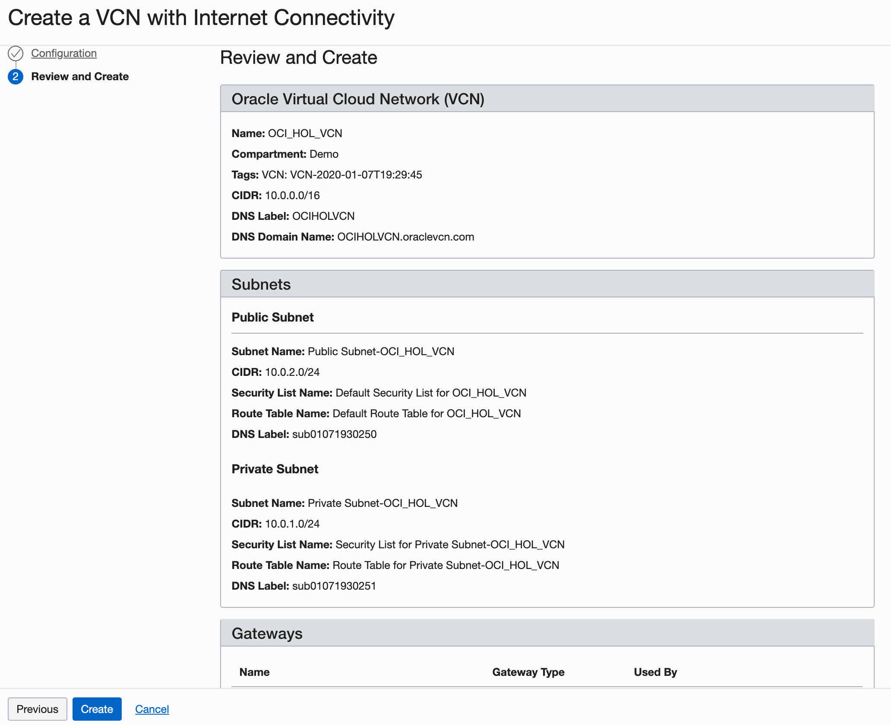
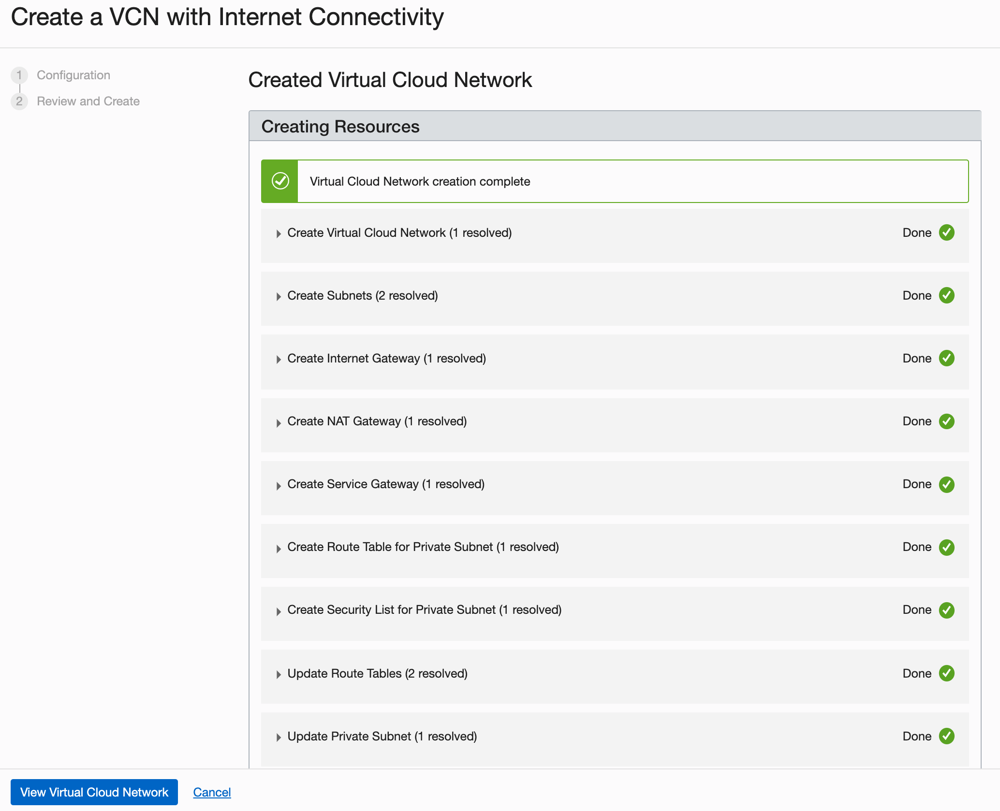

# Create and Configure a Virtual Cloud Network

## Introduction:

Autonomous transaction database database and SQL Developer Web lets you create multiple virtual cloud networks (VCNs). These VCNs will contain the security lists, compute instances, load balancers, and many other types of network assets.

### Objectives

Create a VCN on OCI.

[OHC Learn](https://docs-uat.us.oracle.com/learn/)

### Prerequisites

- Review [Overview of Networking](https://docs.cloud.oracle.com/iaas/Content/Network/Concepts/overview.htm) to gain a full understanding of the network components and their relationships.
- Watch the following video about Networking in the Cloud.

<iframe width="560" height="315" src="https://www.youtube.com/embed/mIYSgeX5FkM" frameborder="0" allow="accelerometer; autoplay; clipboard-write; encrypted-media; gyroscope; picture-in-picture" allowfullscreen></iframe>
 
[Video for Networking in the Cloud EP.01: Virtual Cloud Networks](https://www.youtube.com/watch?v=mIYSgeX5FkM "EP.01 Virtual Cloud Networks")

*Note: If you go to SQL Workshop > Object Browser, select the EBA\_PROJECT\_TASKS table and then click _Create App_ then it will create an app with a Dashboard page, Faceted Search page, Report and Form pages, and a Calendar page (if appropriate) all based on the selected table. This technique provides a great starting point for creating your apps, especially if you are not sure what pages you want up front.*

## Create Your VCN

To see how a VCN is created in Oracle Cloud Infrastructure, watch this short video:

<iframe width="560" height="315" src="https://www.youtube.com/embed/lxQYHuvipx8" frameborder="0" allow="accelerometer; autoplay; clipboard-write; encrypted-media; gyroscope; picture-in-picture" allowfullscreen></iframe>

For more information, watch the following video on youtube.

[Video for Explore how to create a Virtual Cloud Network on OCI](https://www.youtube.com/watch?v=lxQYHuvipx8 "Explore how to create a Virtual Cloud Network on OCI")

To create a VCN on Oracle Cloud Infrastructure:

1. In *Page Designer*, change **Identification > Name** and **Identification > Title** to the new name. Click **Save and Run Page**. In the runtime environment, you will see the tab's name is updated.

1. In the navigation menu, click on **Virtual Cloud Networks**.

1. Sign in to OCI Console using your cloud tenant name, user name, and password.

   > Note: If you go to SQL Workshop > Object Browser. Select this.

1. Click **Option** > **Preferences** then click **OK**.

1. Click **File** -> **Save As** > Edit.

1. From the OCI services menu, click **Virtual Cloud Networks** > **Networking**.

2. From the OCI services menu, click **Virtual Cloud Networks** under **Networking**. Choose the appropriate compartment from under **List Scope** in the left navigation pane. 

3. Select **VCN with Internet Connectivity**, and then click **Start VCN Wizard**.

1. This is a substep.

4. Complete the following fields:

   |                  **Field**              |    **Value**  |
   |----------------------------------------|:------------:|
   |VCN NAME |OCI\_HOL\_VCN|
   |COMPARTMENT | Select the appropriate compartment under **List Scope** in the left navigation pane.  
   |VCN CIDR BLOCK|10.0.0.0/16|
   |PUBLIC SUNBET CIDR BLOCK|10.0.2.0/24|
   |PRIVATE SUBNET CIDR BLOCK|10.0.1.0/24
   |USE DNS HOSTNAMES IN THIS VCN| Checked|

   Your screen should look similar to the following:
	
   

5. Right-click on the **Next** button at the bottom of the screen.

6. Review your settings to be sure they are correct.

   

7. Press  to create the VCN. It will take a moment to create the VCN and a progress screen will keep you apprised of the workflow.

   Press  to create the VCN. It will take a moment to create the VCN and a progress screen will keep you apprised of the workflow.

   

8. Once you see that the creation is complete (see previous screenshot), click on the **View Virtual Cloud Network** button.

In real-world situations, you would create multiple VCNs based on their need for access (which ports to open) and who can access them. 

## Creating Images

This is an image with alt text and an image description: 192.0.2.254

This is an image no alt text 

This is an image with no alt text and an image description

This is an image with no alt text and no image description here.

 
## Acknowledgements

- **Authors** - Flavio Pereira, Larry Beausoleil
- **Contributors** - Oracle LiveLabs QA Team (Kamryn Vinson, QA Intern, Arabella Yao, Product Manager Intern, DB Product Management), Tom McGinn (Database Product Management)

## Learn More

Explore other labs on [docs.oracle.com/learn](https://docs.oracle.com/learn) or access more free learning content on the [Oracle Learning YouTube channel](https://www.youtube.com/user/OracleLearning). Additionally, visit [education.oracle.com/learning-explorer](https://education.oracle.com/learning-explorer) to become an Oracle Learning Explorer.

For product documentation, visit [click here](https://docs.oracle.com).
