# Remove PDBs from CDB

## Introduction

This lab walks you through the steps for removing Pluggable Databases (PDBs) from the Container Database (CDB) using Oracle Enterprise Manager (Oracle EM).

You have two options to remove PDBs from a CDB:
 -   Delete the PDB
 -   Unplug the PDB 

Estimated time: 15 minutes

### Objectives

Perform these tasks from Oracle EM:
 -   Delete a PDB from the root container
 -   Unplug a PDB from the root container
 -   Verify the removal of PDBs

### Prerequisites

This lab assumes you have -

 -   A Free Tier, Paid or LiveLabs Oracle Cloud account
 -   Completed -
	 
     -   Lab: Provision a Pluggable Database (PDB)
 -   Logged in to Oracle EM in a web browser as *sysman*

## Task 1: Delete a PDB from the root container

Oracle EM provides an option to delete PDBs from the database instance home page. This option is not available on the CDB or the PDB home page. Along with the PDB, Oracle Database also deletes its associated data files.

In this task, you will delete the PDB, namely *PDB1*, from the root container using Oracle EM. You can open the Databases page from the menu **Targets** &gt; **Databases**. 

1.  On the Database pages, click on the Database Instance name, for example *orcl.us.oracle.com*.  
    The values may differ depending on the system you are using.  

	 

    The green upward arrow in the **Status** field indicates that the database instance is up and running.

	

1.  From the **Oracle Database** menu on the instance home page, select **Provisioning** &gt; **Provision Pluggable Databases**. The values may differ depending on the system you are using.  

	 

1.  The Provision Pluggable Databases Console opens and displays the options for various PDB operations.  
    Scroll down the page and select **Delete Pluggable Databases**.  
    The values may differ depending on the system you are using.  

	 

    Click **Launch** to start the PDB delete operation. 

	

    The values may differ depending on the system you are using.  

	 

1.  You can select one or more PDBs to delete. Click **Add** to search for the target PDB and add it to the delete list.   

	 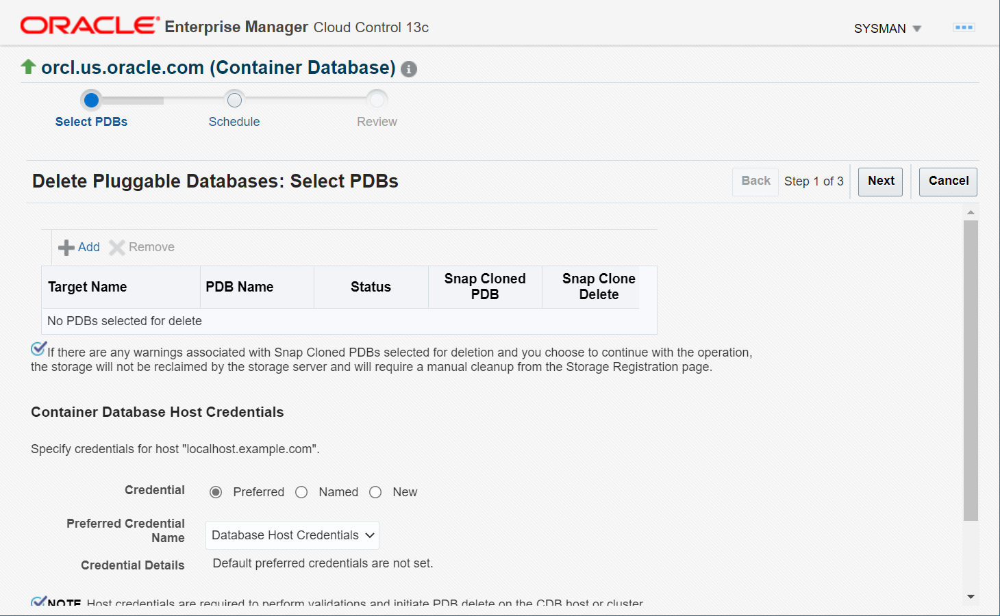

	

1.  Oracle EM opens a pop-up to search and select the target PDBs that you want to delete.    
    The values may differ depending on the system you are using.  

	 

     This window allows multi-select, which means you can add more than one PDBs to the delete list. The green upward arrows in the **Status** field indicate that the PDBs are up and running.  

     > **Note:** To delete multiple PDBs simultaneously, you can either select the PDBs in this pop-up or repeat this step to add each PDB individually.    

    For this lab, select *PDB1* from the target PDB list and click **Select** to add the PDB to the delete list. The window goes back to the Select PDBs page.  

1.  Verify that the table displays the PDB you selected.  
    The snap clone information may show blank or n/a because it is not applicable for this lab.   
    The values may differ depending on the system you are using.  

	 

     > **Note:** If the PDB you selected for deletion is wrong, then select the PDB and click **Remove**. This does not delete the PDB but clears it from the delete list and leaves the PDB intact. Ignore this note if you have selected the correct PDB for deletion.  

    You can also click **Add** to select more PDBs for deletion. For this lab, delete only one PDB, *PDB1*. 

1.  Scroll down the page. Under **Container Database Host Credentials**, select the *Named* Credential option, if not already selected.   
    The values may differ depending on the system you are using.  

	 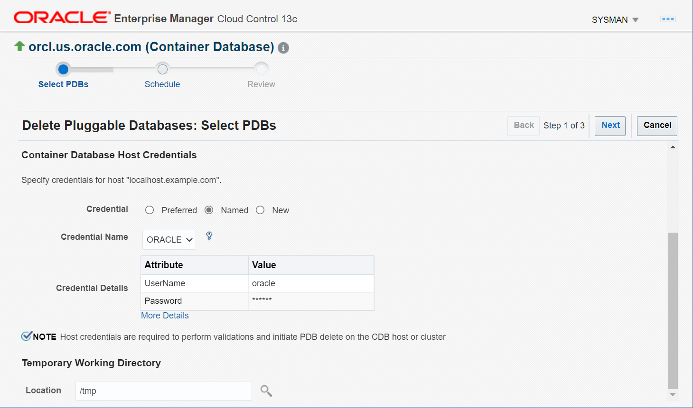

	

    Leave the default value for **Temporary Working Directory** and click **Next** to proceed.  

1.  Oracle EM takes a while to validate and prompts to schedule the delete operation.  

	 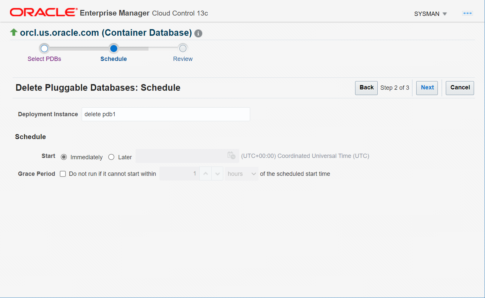

    Specify the following:  

	 -  **Deployment Instance** - Delete the default text and enter a unique name, *delete pdb1*.  
    The instance name you enter helps you identify and track the progress of this procedure on the Procedure Activity page.

		> **Note:** If the instance name already exists, then Oracle EM returns a validation error. You cannot create procedures in Oracle EM with duplicate names.   

	 - **Start** - Leave the default, *Immediately*, to run the procedure now.  

	

    Click **Next** to proceed.  

1.  The Review page displays a summary of the PDB delete operation. For example, the container database name, the PDB name which you entered, the target details, the data files, and so on. This page also displays the data files, which the database deletes along with the PDB.   
    The values may differ depending on the system you are using.  

	 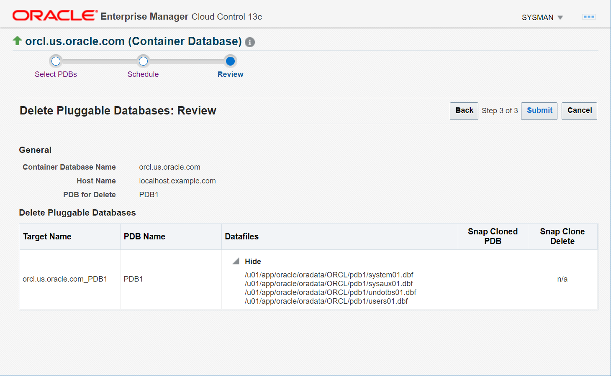

	Verify that the **PDB for Delete** field displays *PDB1*.   
    Review the details and click **Submit** to start deleting the PDB.  

1.  Oracle EM displays a confirmation pop-up.   

	 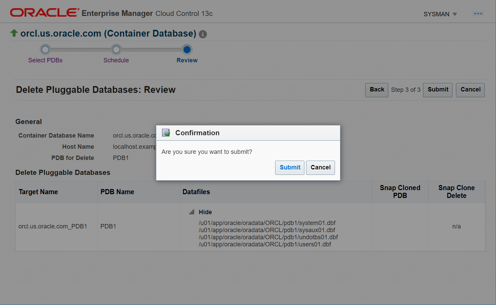

    Click **Submit** again to start deleting the PDB.   

    Oracle EM goes to the Provision Pluggable Databases page and displays the status of the procedure. This page contains the detailed steps of the PDB operation. After the PDB is deleted, the **Status** field changes from *Running* to *Succeeded*.  
    The values may differ depending on the system you are using.  

	 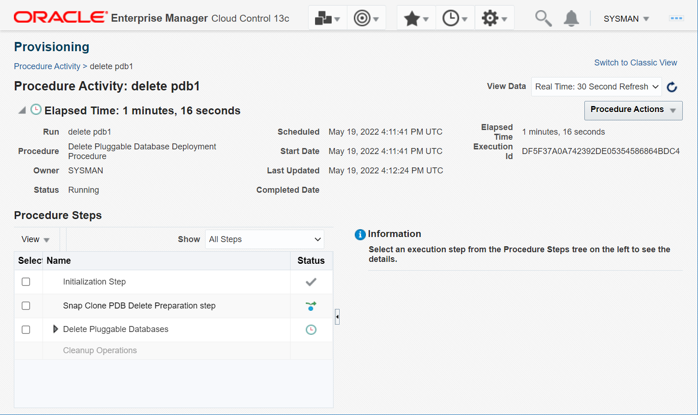

	

You have deleted *PDB1* from the root container. Now, try unplugging a PDB from the root container. 

## Task 2: Unplug a PDB from the root container

Oracle EM provides an option to unplug PDBs from the database instance home page. This option is not available on the CDB or the PDB home page. 

In this task, you will unplug the PDB, namely *PDB2*, from the root container using Oracle EM.

1.  From the **Targets** menu, select **Databases** to open the Databases page.  

	 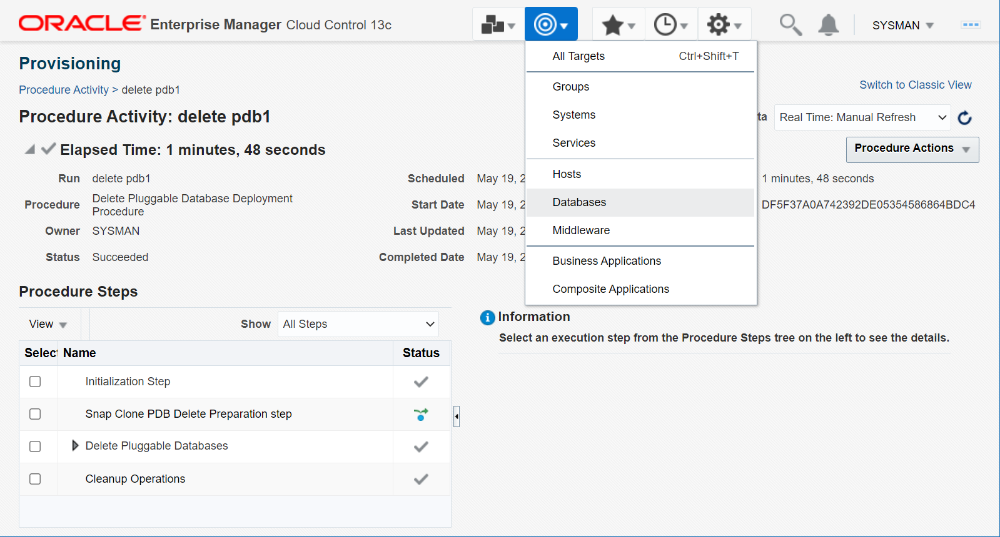

1.  The Databases page displays the discovered database system targets, that is, the Database Instances on the host and the PDBs in each instance.  
    The values may differ depending on the system you are using.  

	 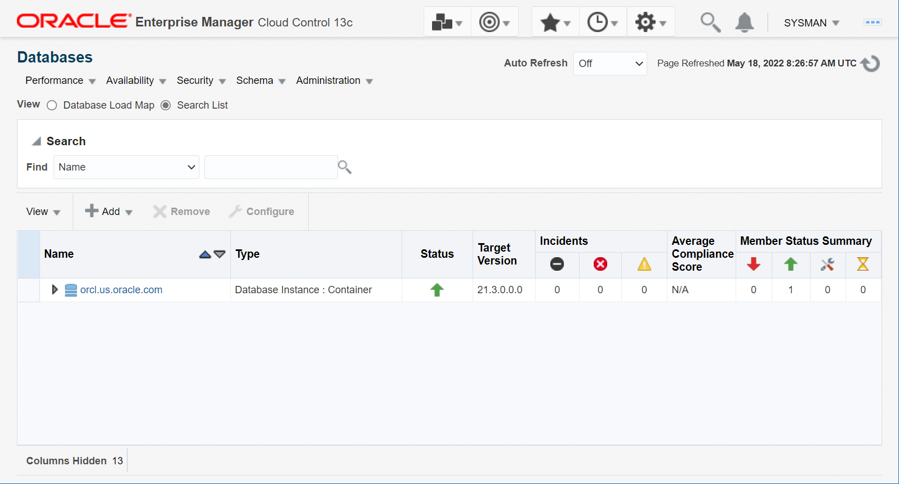

    Click on the Database Instance name, for example *orcl.us.oracle.com*, to open the instance home page. 

1.  From the **Oracle Database** menu on the instance home page, select **Provisioning** &gt; **Provision Pluggable Databases**. The values may differ depending on the system you are using.  

	 

1.  The Provision Pluggable Databases Console opens and displays the options for various PDB operations.  
    Scroll down the page and select **Unplug Pluggable Databases**.  
    The values may differ depending on the system you are using.  

	 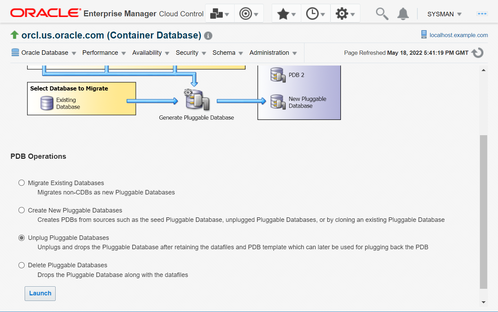

    Click **Launch** to start the PDB unplug operation.  

	

1.  You need to select the PDB that you want to unplug. Click on the magnifier icon next to the **Pluggable Database** field to search for the target PDB.   
    The values may differ depending on the system you are using.  

	 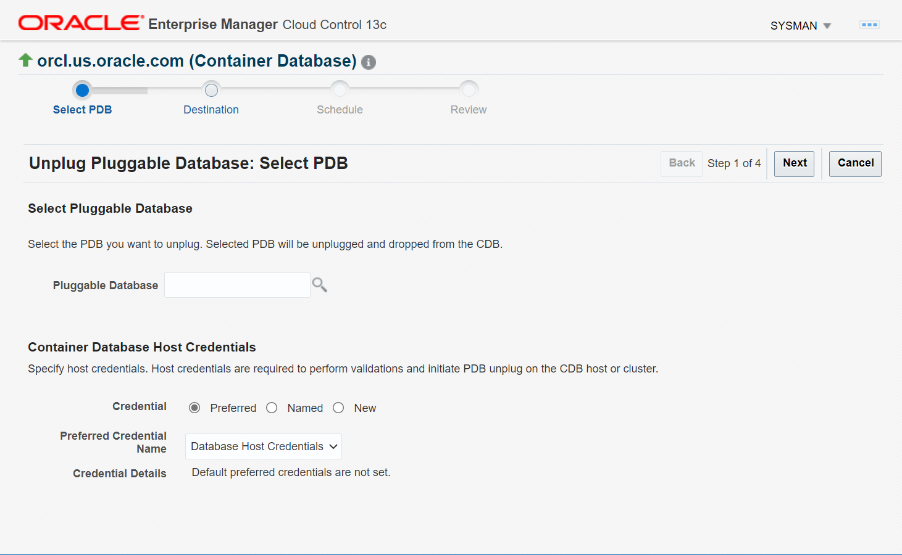

     > **Note:** Though you can type the PDB name in this field, Oracle recommends using the search and select PDB option.   

1.  Oracle EM opens a pop-up to search and select the PDB that you want to unplug.   
    The values may differ depending on the system you are using.  

	 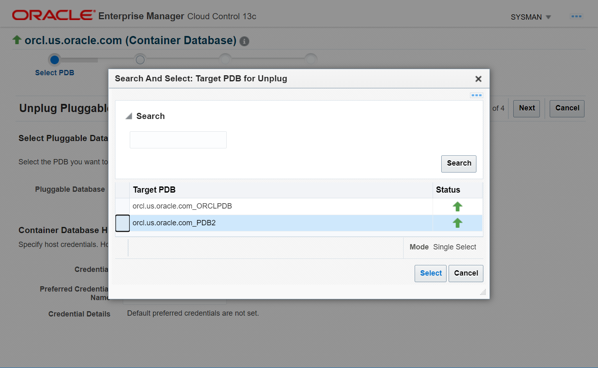

    This window allows single-select, which means you can select only one target PDB.   
    For this task, select *PDB2* and click **Select** to proceed. The window goes back to the Select PDB page.  

1.  Verify that the **Pluggable Database** field displays the PDB name you selected.  

	 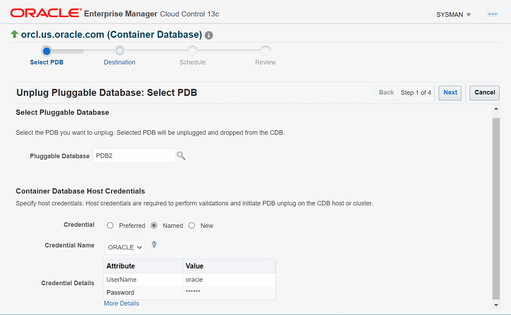

    Scroll down the page. Under **Container Database Host Credentials**, select the *Named* Credential option, if not already selected. Click **Next** to proceed.  

1.  In the Unplug PDB Destination page, select the type of PDB template you want to generate for unplugging the PDB, and the location where you want to store it. The PDB template consists of all data files and the metadata XML file.  

	 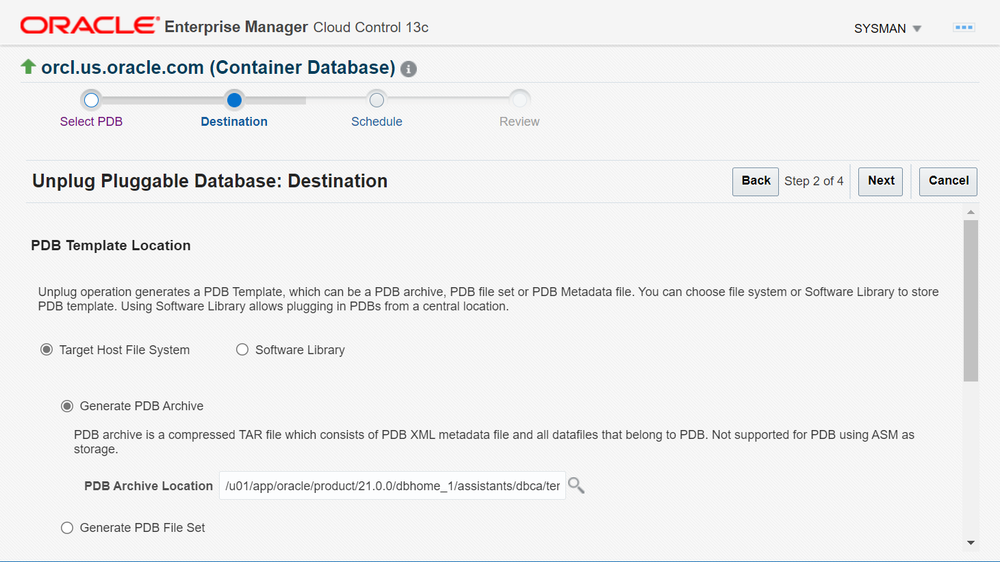

    The page displays the default options *Target Host File System* and *Generate PDB Archive* selected. Oracle recommends selecting these options if the source and the target CDBs are using File System for storage.  

     - **Target Host File System** - stores the PDB template on the CDB host from where you are unplugging the PDB  
     - **Generate PDB Archive** - creates a single archive (*TAR*) file with the data files and the metadata XML file  

    For this lab, leave the defaults and click **Next** to proceed.   

	 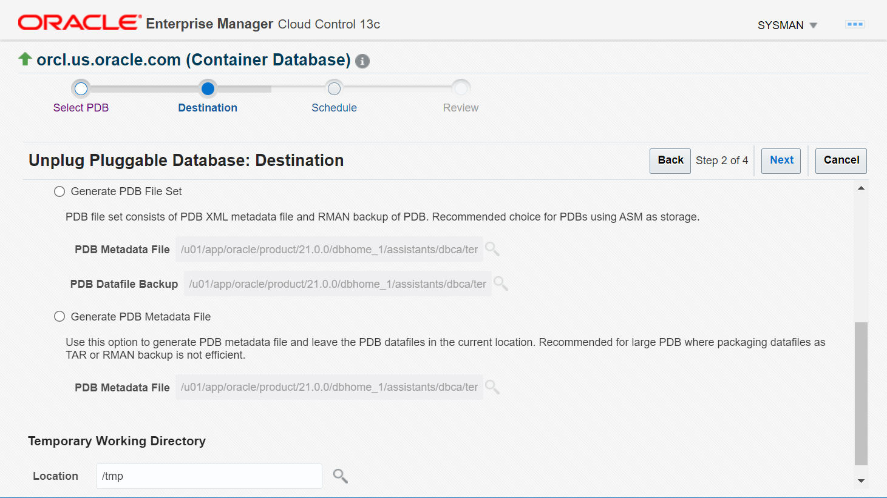

     > **Note:** The PDB unplug operation generates a PDB template, which can be a PDB archive, a PDB file set, or a PDB Metadata file. You can select the location to store the PDB template as File System or Software Library. The Software Library option allows plugging in PDBs from a central location.  

1.  Oracle EM takes a while to validate and prompts to schedule the unplug operation.  

	 

    Specify the following:

     - **Deployment Instance** - Delete the default text and enter a unique name, *unplug pdb2*.  
    The instance name you enter helps you identify and track the progress of this procedure on the Procedure Activity page.  

     - **Start** - Leave the default, *Immediately*, to run the procedure now.  

    For this lab, do not select the grace period option.   
    Click **Next** to proceed.  

1.  The Review page displays a summary of the PDB unplug operation. For example, the container database name, the PDB name you selected, and the host details.   
    The values may differ depending on the system you are using.  

	 

	Verify that the **PDB Archive** field displays the *full path and location of the file system*.   
    Review the details and click **Submit** to start unplugging the PDB from the root container.  

1.  Oracle EM displays a confirmation pop-up.   

	 

    Click **View Execution Details** to open the Procedure Activity page and view the status of the procedure.   

     > **Note:** If you click **OK**, Oracle EM goes to the Provision Pluggable Databases page.  

    The Procedure Activity page contains the detailed steps of the PDB operation. After the PDB is unplugged, the **Status** field changes from *Running* to *Succeeded*.  
    The values may differ depending on the system you are using.  

	 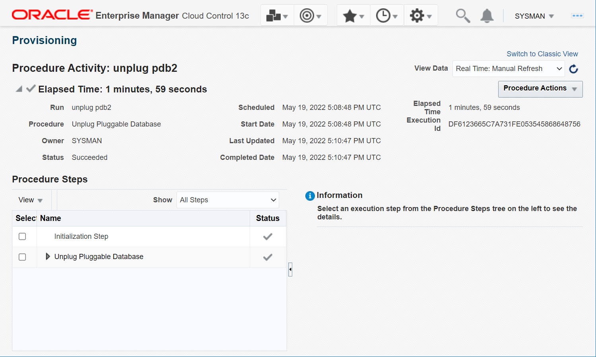

You have unplugged *PDB2* from the CDB. Now, verify that the PDBs you removed are no longer available in the database instance. 

## Task 3: Verify the removal of PDBs

After deleting and unplugging the PDBs in the above tasks, you can check that Oracle Database has removed the PDBs.

In this task, you will verify that you have removed the PDBs, namely *PDB1* and *PDB2*, from the database.

1.  From the **Targets** menu, select **Databases** to open the Databases page.   
    The values may differ depending on the system you are using.  

	 

1.  The Databases page displays the discovered database system targets. 

	Click on the expand/collapse triangle next to the instance name, for example *orcl.us.oracle.com*, from where you removed the PDBs. The values may differ depending on the system you are using.  

	 

    Note that the database instance does not display *PDB1* and *PDB2* that you removed. The list now displays only one PDB, *ORCLPDB*.  

In this lab, you learned how to remove PDBs from your Oracle Database. You deleted a PDB and unplugged another PDB from the root container. You also verified that you removed these PDBs from the Oracle Database. 

You may now **proceed to the next lab**.

## Acknowledgements

 -   **Author**: Manish Garodia, Database User Assistance Development team
 -   **Contributors**: Suresh Rajan, Ashwini R, Jayaprakash Subramanian
 -   **Last Updated By/Date**: Manish Garodia, October 2022
