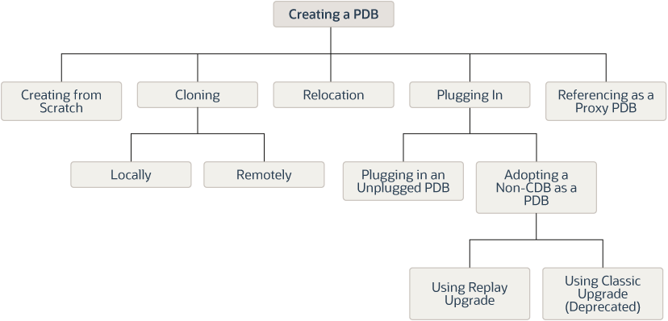
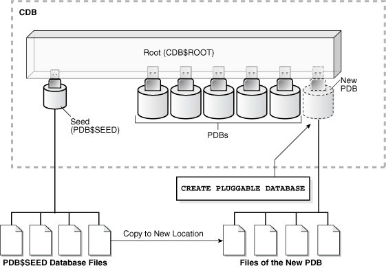
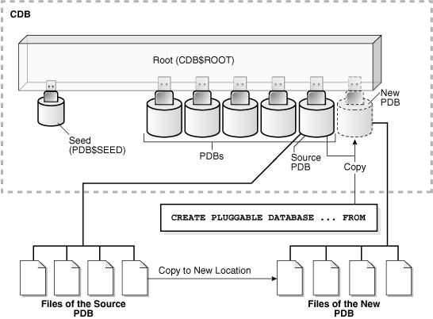
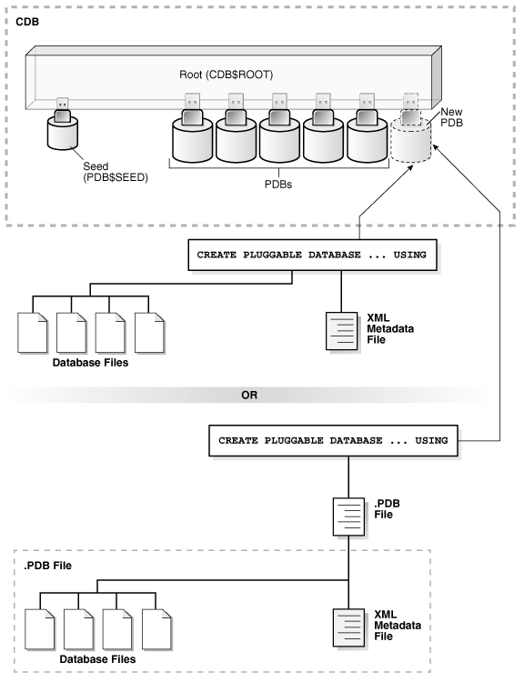
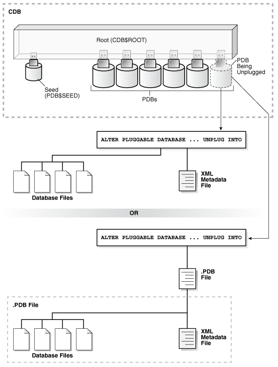

# PDB management in Oracle Database

## About this workshop

This workshop guides you on how to manage *Pluggable Databases (PDBs)* in a multitenant Container Database (CDB) from Oracle Enterprise Manager (Oracle EM). Database administrators (DBAs) can manage a CDB and its underlying PDBs and perform administrative tasks, such as creating and removing PDBs from Oracle Database and administering the PDBs.  
The labs in this workshop will help you learn about the sequence of actions you must perform to complete these tasks successfully.

**What are PDBs?**

An Oracle Database can contain a portable collection of schemas, schema objects, and non-schema objects that appear to an Oracle Net client as a separate database. This self-contained collection is a *PDB*. A CDB can include zero or more PDBs.

Watch this video to learn about the core concepts of a multitenant CDB.

### Objectives

In this workshop, you will learn how to:

 -   Create PDBs
     -   *from the Seed* 
     -   *by cloning another local PDB*
     -   *by* *plugging an unplugged PDB*
 -   Remove PDBs from the root container
     -   *by dropping PDBs*
     -   *by unplugging PDBs*
 -   Perform administrative tasks, such as -
     -   *closing the PDBs*
     -   *opening the PDBs*

### Prerequisites

This lab assumes you have -
 -   A Free Tier, Paid or LiveLabs Oracle Cloud account

## Appendix 1: Activities for PDB management

The following image illustrates the activities that you can perform for managing the PDBs in your CDB.

In particular, this workshop aims at explaining the following for PDB management:
 -   Different ways of creating new PDBs in a CDB
 -   How to remove PDBs from the CDB
 -   Administrative actions, such as close and open PDBs

In this workshop, you will perform these activities using Oracle EM. However, you can also do these from the SQL prompt and from EM CLI.

See the [Learn More](?lab=intro-pdb-mgmt-odb#LearnMore) section at the bottom of this lab for more information.

## Appendix 2: PDB lifecycle management and administration

### PDB create operations

Oracle Database provides various options for creating new PDBs in a container.

For creating PDBs, this workshop will walk you through the following:

 -   **Option 1**: Create a PDB from scratch 
 -   **Option 2**: Clone a source PDB in the local container
 -   **Option 3**: Plug an unplugged PDB into the container

You will find more information about these concepts, that is, source PDB, local container, and unplugged PDB, in their respective sections below.  

**Create a PDB from scratch**

When you can create a PDB from scratch, you use the Seed (*PDB$SEED*) files. This method copies the Seed files to a new location and associates the copied files with the new PDB.

Before creating a new PDB from the Seed in Oracle EM, ensure that:

 -   The CDB, where you want to create the PDB, exists and Oracle EM has access to it as a managed target.
 -   The target CDB is open and not in the read-only, upgrade, or downgrade mode.
 -   The host user (for this workshop it is *oracle*) is the owner of the Oracle home where the target CDB resides.

See [Creating a new PDB](https://docs.oracle.com/en/enterprise-manager/cloud-control/enterprise-manager-cloud-control/13.5/emlcm/managing-pluggable-databases-using-enterprise-manager.html#GUID-565EDEB2-F3EF-4FC3-8DE9-0205BDBDD260) for more information on the prerequisites for creating a new PDB from the seed.

**Clone a source PDB in the local container**

You can create PDBs in the container by cloning an existing PDB, which is the source PDB. This method copies the files that belong to the source PDB to a new location and associates the copied files with the new PDB.

Before cloning a local PDB from Oracle EM, ensure that:

 -   The source PDB, that you want to clone, exists and Oracle EM has access to it as a managed target.
 -   The source PDB is open and not in the read-only, upgrade, or downgrade mode.
 -   The destination CDB, where you want to create the clone, exists and Oracle EM has access to it as a managed target.
 -   The host user (for this workshop it is *oracle*) is the owner of the Oracle home where the target CDB resides.

 > **Note:** The location of the source PDB can be a CDB on the same (local) host, a CDB on a remote host, or an application container on the local or a remote host. If a database, a CDB, or a PDB resides on the local host, then it is termed as a local database, a local CDB, or a local PDB respectively. 

See [Cloning a PDB](https://docs.oracle.com/en/enterprise-manager/cloud-control/enterprise-manager-cloud-control/13.5/emlcm/managing-pluggable-databases-using-enterprise-manager.html#GUID-ECEBA8A8-7BC3-4B70-B11F-D3035C195AD9) for more information on the prerequisites for cloning a PDB.

You can clone a PDB in Oracle Database using the following methods:

 -   **Full Clone**   
	This method allows you to clone a PDB only to the source CDB, that is, the CDB where you are cloning the PDB. It is ideal for load testing, and is useful for long-term usage. However, this method takes longer and requires a large amount of space. 

 -   **Snap Clone**   
	Users often require clones of production databases for development and testing purposes. It can be difficult and time-consuming to create clones, especially if the databases are huge. With this method, you can create thin clones of large databases with little space in less time.

	 > **Note:** Snap Clone is a storage agnostic approach for creating quick and space-efficient clones of huge production databases. This method is ideal for functional testing and is useful for short-term purposes. The cloning process is quick and the clone PDB occupies less space. 

**Plug an unplugged PDB**

You can create a PDB in the container by plugging in an unplugged PDB. 

This method uses one of the following:

 -   An unplugged PDB in the form of an *XML* metadata file.  
    This file describes the PDB and the files associated with the PDB.  

 -   An unplugged PDB in the form of a *.PDB* file.  
    This file is a compressed archive of the XML file that describes the PDB and the files used by the PDB (such as the data files and wallet file). The `.PDB` file enables you to copy a single, compressed file (instead of multiple files) to a new location to plug the PDB into a CDB.

You will find more information about an unplugged PDB in its respective section below. 

Before plugging in an unplugged PDB in Oracle EM, ensure that:

 -   The CDB, where you want to plug the PDB, exists and Oracle EM has access to it as a managed target.
 -   The target CDB is open and not in the read-only, upgrade, or downgrade mode.
 -   The host user (for this workshop it is *oracle*) is the owner of the Oracle home where the target CDB resides.
 -   The XML file, which describes the unplugged PDB and the other files associated with the unplugged PDB, such as the data files and the wallet file, exists and is readable.

See [Plugging in an unplugged PDB](https://docs.oracle.com/en/enterprise-manager/cloud-control/enterprise-manager-cloud-control/13.5/emlcm/managing-pluggable-databases-using-enterprise-manager.html#GUID-CFB4889A-A112-4E05-B393-91F431135907) for more information on the prerequisites for plugging a PDB.

### PDB remove operations

To remove a PDB from a CDB, you can:
 -   unplug the PDB
 -   delete the PDB

**Unplug a PDB**

A PDB is usable only when you plug it into a CDB. Unplugging a PDB disassociates the PDB from a CDB.

You can unplug the PDB from the source container and plug it into a destination container on the local or a remote host. This process helps in moving PDBs across containers without losing the data. 

Unplug a PDB if you want to:
 -   Move the PDB from one container to another
 -   Archive the PDB for later use
 -   Render the PDB unavailable for use

When you unplug a PDB from the CDB:
 -   You remove the PDB from the root container without deleting it or its associated data files.
 -   Oracle Database closes the PDB with the `IMMEDIATE` option.
 -   Oracle Database drops the PDB from the instance.  

Before unplugging a PDB from the CDB in Oracle EM, ensure that:
 -   The CDB, from where you want to unplug the PDB, exists and Oracle EM has access to it as a managed target.
 -   Open the PDB that you want to unplug at least once. 
 -   The host user (for this lab it is *oracle*) is the owner of the Oracle home where the target CDB resides.    

See [Unplugging a PDB](https://docs.oracle.com/en/enterprise-manager/cloud-control/enterprise-manager-cloud-control/13.5/emlcm/managing-pluggable-databases-using-enterprise-manager.html#GUID-12FCF4D2-B76D-4A7B-8EF2-0843B8251CC5) for more information on the prerequisites for unplugging a PDB.

 > **Note:** You can create a new PDB by plugging in the unplugged PDB back either into the same container or into another container.

Another way of removing a PDB is to delete the PDB. 

**Delete a PDB**

When you delete a PDB from a CDB, it permanently removes the PDB along with its data files. 

Before deleting a PDB from the CDB in Oracle EM, ensure that:

 -   The CDB, from where you want to delete the PDB, exists and Oracle EM has access to it as a managed target.
 -   Open the PDB that you want to delete at least once. 
 -   The host user (for this workshop it is *oracle*) is the owner of the Oracle home where the target CDB resides.    

See [Deleting a PDB](https://docs.oracle.com/en/enterprise-manager/cloud-control/enterprise-manager-cloud-control/13.5/emlcm/managing-pluggable-databases-using-enterprise-manager.html#GUID-29383471-9AC3-4C0A-B398-D06F12B2AC74) for more information on the prerequisites for dropping a PDB.

### PDB administration

From Oracle EM, you can perform various administrative activities on PDBs. These include changing the state of the PDBs. 

You can turn a PDB into the following states:

 -   **Open**   
    The PDB is in the read-write mode. Users can connect to the PDB, run queries, perform transactions, and generate redo logs. 

 -   **Open Read-Only**   
    The PDB is in the read-only mode. It allows connecting to the PDB and running queries but does not allow any transactions or changes to the database, such as create, insert, update, or delete operations.  

 -   **Close**   
    This is similar to the shutdown mode. The PDB is not accessible for any queries or transactions.  

The following image illustrates the PDB open operation. 

 

The following image illustrates the PDB close operation. 

 

When the database instance restarts or after you close a PDB manually, the PDB goes into the *MOUNTED* mode. To allow the users to perform transactions on the PDB, ensure that the PDB is in the *OPEN* state. 

Before closing or opening a PDB from Oracle EM, ensure that:

 -   The PDB, that you want to close or open, exists in the CDB and Oracle EM has access to it as a managed target.
 -   The CDB, which contains the PDB, is in the *Read-Write* mode.
 -   You have the `SYSDBA`, `SYSOPER`, `SYSBACKUP`, or `SYSDG` administrative privileges. The privileges may be common to the root container or granted locally in the PDB.    

When you close a PDB immediately, Oracle Database responds as follows:

 -   Disconnects the users that are connected to the PDB
 -   Rolls back the active transactions on the PDB 

In the subsequent labs, you will perform tasks related to PDB management and administration.

Click on the next lab to **Get started**. 

## Learn More

 -   [Administrator's Guide: Overview of PDB Creation](https://docs.oracle.com/en/database/oracle/oracle-database/21/multi/overview-of-pdb-creation.html#GUID-C95E8613-C556-4818-BE64-B2129AC2F8A2)
 -   [Managing Pluggable Databases Using Enterprise Manager](https://docs.oracle.com/en/enterprise-manager/cloud-control/enterprise-manager-cloud-control/13.5/emlcm/managing-pluggable-databases-using-enterprise-manager.html#GUID-01F10E2F-710F-4C57-8A1C-E41557B65041)
 -   [Database Concepts: PDBs](https://docs.oracle.com/en/database/oracle/oracle-database/21/cncpt/CDBs-and-PDBs.html#GUID-49C0C90D-5A72-4131-8C3D-B07341C75CB2)
 -   [Provisioning PDBs using EM CLI](https://docs.oracle.com/en/enterprise-manager/cloud-control/enterprise-manager-cloud-control/13.5/emlcm/provisioning-pluggable-databases.html)

## Acknowledgements

 -   **Author** - Manish Garodia, Database User Assistance Development team
 -   **Contributors** - Suresh Rajan
 -   **Last Updated By/Date** - Manish Garodia, October 2022
